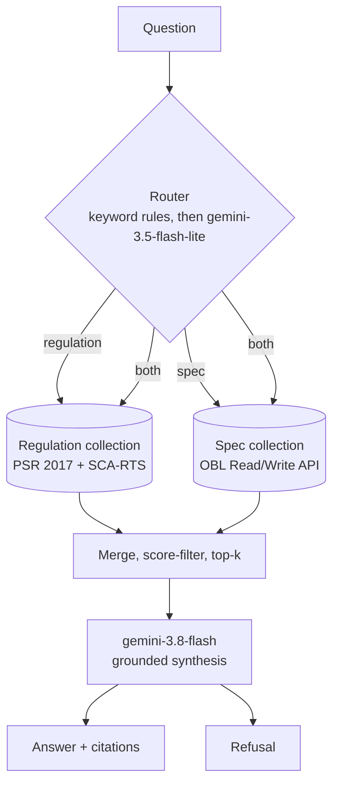

# UK Open Banking RAG v1 — Implementation Plan

> **For agentic workers:** REQUIRED SUB-SKILL: Use superpowers:subagent-driven-development (recommended) or superpowers:executing-plans to implement this plan task-by-task. Steps use checkbox (`- [ ]`) syntax for tracking.

**Goal:** Ship a retrieval-augmented Q&A system over UK Open Banking that answers regulation questions, API-spec questions, and cross-cutting questions with grounded citations and honest refusals — plus an eval harness and a hosted demo, packaged as an Upwork case study.

**Architecture:** Two separate Chroma collections (regulation, spec), a cheap router that picks one or both, retrieval from the chosen collections, and a single Claude call that synthesises an answer with inline citations or refuses. Every layer is a plain Python module with one job; no RAG framework.

**Tech Stack:** Python 3.12 · `uv` · Google Gemini via the `google-genai` SDK (`gemini-3.8-flash` generation, `gemini-3.5-flash-lite` routing, `gemini-3.1-pro-preview` eval judging) · Voyage AI embeddings (`voyage-3`, A/B'd against `voyage-law-2`) · Chroma (embedded) · `lxml` + `PyYAML` parsing · SQLite eval store · Streamlit UI on Streamlit Community Cloud.

**Spec:** `open-banking-rag-design.md` (repo root)

## How to use this plan

Each **Session** below is one self-contained Claude Code session. Open a new session, paste this:

> Read `docs/superpowers/plans/2026-09-18-open-banking-rag-v1.md` and `open-banking-rag-design.md`. Execute **Session N** only. Stop when its final commit is done and report what you did.

Sessions are strictly ordered — each depends on the ones before it. Session 0 is yours alone (no Claude). Sessions 1–11 are code. Session 12 is writing.

## Global Constraints

- Python 3.12. Dependency management is `uv` only — never `pip install` into the system Python.
- Package root is `src/obrag/`. All imports are absolute: `from obrag.config import settings`.
- No LangChain, LlamaIndex, Haystack, or any RAG framework. If a task seems to need one, the task is wrong — stop and say so.
- Model IDs, verbatim: generation `gemini-3.8-flash`, router `gemini-3.5-flash-lite`, eval judge `gemini-3.1-pro-preview`. Never invent a variant. If the preview judge model proves unstable, fall back to `gemini-2.5-pro` and record the swap.
- The SDK is `google-genai`, imported as `from google import genai`. The older `google-generativeai` package is a different, superseded library — do not install it, and do not copy code that uses it.
- Every model call goes through `client.interactions.create(model=..., system_instruction=..., input=...)`, and the text comes back on `.output_text`. There is no `generate_content` call anywhere in this project.
- Structured output uses `response_format={"type": "text", "mime_type": "application/json", "schema": Model.model_json_schema()}`, parsed with `Model.model_validate_json(interaction.output_text)`.
- The Gemini key lives in `GEMINI_API_KEY` — that is the variable the SDK itself looks for, so use that exact name rather than inventing one.
- **Known weakness, accepted deliberately:** the eval judge is a Gemini model grading Gemini output. Single-vendor was chosen over cross-family judging. This must be stated plainly as a limitation in the case study (Session 12), not glossed over.
- No API keys in source, ever. Keys come from environment variables only. `.env` is gitignored; `.env.example` is committed with empty values.
- Every answer surfaced to a user carries the disclaimer string and the snapshot date from `obrag.config`. This is not optional and not a UI-only concern.
- Tests use `pytest`. Network-touching tests are marked `@pytest.mark.network` and excluded from the default run.
- Commit after every session, minimum. Conventional commit prefixes (`feat:`, `test:`, `docs:`, `chore:`).

---

## File Structure

```
openbanking/
├── pyproject.toml              # uv project, deps, pytest config
├── requirements.txt            # exported from uv, for Streamlit Cloud only
├── .env.example                # committed, empty values
├── .gitignore
├── README.md
├── open-banking-rag-design.md  # the spec
├── docs/superpowers/plans/     # this plan
├── src/obrag/
│   ├── config.py               # Settings: keys, model IDs, paths, disclaimer, snapshot date
│   ├── models.py               # Chunk, RetrievedChunk, Answer dataclasses — the shared vocabulary
│   ├── ingest/
│   │   ├── fetch.py            # download + pin raw sources into data/raw/
│   │   ├── obl_spec.py         # OpenAPI YAML  -> Chunk[]  (collection="spec")
│   │   └── legislation.py      # CLML XML      -> Chunk[]  (collection="regulation")
│   ├── index/
│   │   ├── embedder.py         # Voyage batching + on-disk cache
│   │   ├── store.py            # Chroma get_or_create / upsert / query
│   │   └── build.py            # CLI entrypoint: build both collections
│   ├── query/
│   │   ├── router.py           # route(question) -> list[Collection]
│   │   ├── retriever.py        # retrieve(question, collections) -> RetrievedChunk[]
│   │   ├── generator.py        # generate(question, chunks) -> Answer
│   │   └── pipeline.py         # ask(question) -> Answer   <- the one public entrypoint
│   ├── evaluation/
│   │   ├── storage.py          # SQLite schema + read/write
│   │   ├── metrics.py          # 4 LLM-judge scorers
│   │   └── runner.py           # run the golden set, persist results
│   └── app/
│       ├── streamlit_app.py    # chat + citations + eval dashboard
│       └── limits.py           # per-session query cap + cached demo answers
├── data/
│   ├── raw/                    # gitignored — downloaded sources
│   ├── chroma/                 # gitignored — vector store
│   ├── golden/questions.jsonl  # COMMITTED — the golden set
│   └── eval.db                 # gitignored
└── tests/                      # mirrors src/obrag/
```

Note the package is `obrag.evaluation`, not `obrag.eval` — `eval` shadows a Python builtin and confuses tooling.

---

# Session 0 — Accounts and keys (you, not Claude)

No code. Do this before Session 1; Sessions 1–5 will fail without it. Budget ~30 minutes.

- [ ] **Google AI Studio (Gemini API)** — sign in at `aistudio.google.com` with a Google account and create an API key. **Stay on the free tier.** The free tier is rate-limited rather than billed, which means a shared demo link can be throttled but cannot run up a bill — that is a real advantage over a metered key and the reason not to enable billing unless you hit the limits. If you do later enable Cloud billing, set a Cloud Billing budget alert at the same time.
- [ ] **Voyage AI** — sign up at `voyageai.com`, create an API key. The free tier covers v1's indexing volume comfortably; you are embedding a few thousand chunks once, not continuously.
- [ ] **GitHub** — you need a repo for the code and, separately, as the deploy source for Streamlit Cloud. Create an empty **public** repo named `open-banking-rag` (public so the case study is readable and so Streamlit Cloud's free tier works). Do not push anything yet — Session 1 does that.
- [ ] **Streamlit Community Cloud** — sign up at `share.streamlit.io` with the same GitHub account and authorise repo access. Do not create an app yet; Session 11 does that.
- [ ] Note your two API keys somewhere you can paste them from in Session 1. Do not put them in a file inside the repo.

**Not needed for v1:** an Anthropic account (Gemini does generation, routing and judging), FCA Handbook account (deferred to v2), Firecrawl (v2), any vector database service, any hosting beyond Streamlit Cloud.

**Rough running cost:** indexing is a one-off ~£1–3 of Voyage embeddings — the only part that reliably costs money. On the Gemini free tier the demo and the eval runs cost nothing in cash; what they consume is rate-limit quota, so a burst of demo traffic shows up as throttling rather than a bill. The per-session query cap in Session 11 exists to keep the demo inside those limits and to stop a runaway loop, not to control spend.

---

# Session 1 — Project scaffold and configuration

**Files:**
- Create: `pyproject.toml`, `.gitignore`, `.env.example`, `src/obrag/__init__.py`, `src/obrag/config.py`, `src/obrag/models.py`
- Test: `tests/test_config.py`, `tests/test_models.py`

**Interfaces:**
- Consumes: nothing.
- Produces:
  - `obrag.config.Settings` — frozen dataclass; `obrag.config.settings` — module-level singleton built from environment.
  - `obrag.config.DISCLAIMER: str`, `obrag.config.SNAPSHOT_DATE: str`
  - `obrag.models.Chunk`, `obrag.models.RetrievedChunk`, `obrag.models.Answer`, `obrag.models.Collection`

- [ ] **Step 1: Initialise the project**

```bash
cd /Users/rochakagarwal/orca/projects/openbanking
uv init --package --name obrag --python 3.12
uv add google-genai voyageai chromadb lxml pyyaml python-dotenv streamlit requests pydantic
uv add --dev pytest pytest-mock
```

If `uv` is not installed: `curl -LsSf https://astral.sh/uv/install.sh | sh`.

- [ ] **Step 2: Write `.gitignore`**

```gitignore
.venv/
__pycache__/
*.pyc
.env
data/raw/
data/chroma/
data/eval.db
.pytest_cache/
.DS_Store
```

- [ ] **Step 3: Write `.env.example`**

```bash
GEMINI_API_KEY=
VOYAGE_API_KEY=
```

- [ ] **Step 4: Add pytest config to `pyproject.toml`**

Append:

```toml
[tool.pytest.ini_options]
testpaths = ["tests"]
markers = ["network: hits a real network endpoint (deselected by default)"]
addopts = "-m 'not network'"
```

- [ ] **Step 5: Write the failing test for models**

`tests/test_models.py`:

```python
from obrag.models import Chunk, RetrievedChunk, Answer


def test_chunk_carries_citation_and_collection():
    chunk = Chunk(
        id="reg:2017/752/68/1",
        text="A payment service provider must...",
        collection="regulation",
        citation="PSR 2017, reg. 68(1)",
        source_url="https://www.legislation.gov.uk/uksi/2017/752/regulation/68",
    )
    assert chunk.collection == "regulation"
    assert chunk.citation == "PSR 2017, reg. 68(1)"
    assert chunk.metadata == {}


def test_answer_records_refusal_and_citations():
    answer = Answer(text="I don't have...", citations=[], refused=True, retrieved=[])
    assert answer.refused is True
    assert answer.citations == []


def test_retrieved_chunk_pairs_chunk_with_score():
    chunk = Chunk(id="a", text="t", collection="spec", citation="c", source_url="u")
    assert RetrievedChunk(chunk=chunk, score=0.81).score == 0.81
```

- [ ] **Step 6: Run it and watch it fail**

Run: `uv run pytest tests/test_models.py -v`
Expected: FAIL — `ModuleNotFoundError: No module named 'obrag.models'`

- [ ] **Step 7: Write `src/obrag/models.py`**

```python
"""Shared vocabulary for the whole pipeline.

Every stage — ingestion, indexing, retrieval, generation, eval — passes these
three types around. Keeping them in one small module is what lets each stage be
written and tested without importing any other stage.
"""

from dataclasses import dataclass, field
from typing import Literal

Collection = Literal["regulation", "spec"]


@dataclass(frozen=True)
class Chunk:
    """One indexable unit of source material, with everything needed to cite it."""

    id: str
    text: str
    collection: Collection
    citation: str
    source_url: str
    metadata: dict = field(default_factory=dict)


@dataclass(frozen=True)
class RetrievedChunk:
    chunk: Chunk
    score: float


@dataclass(frozen=True)
class Answer:
    text: str
    citations: list[str]
    refused: bool
    retrieved: list[RetrievedChunk]
```

- [ ] **Step 8: Run the test**

Run: `uv run pytest tests/test_models.py -v`
Expected: PASS (3 passed)

- [ ] **Step 9: Write the failing test for config**

`tests/test_config.py`:

```python
import pytest

from obrag.config import DISCLAIMER, SNAPSHOT_DATE, Settings, load_settings


def test_load_settings_reads_keys_from_environment(monkeypatch):
    monkeypatch.setenv("GEMINI_API_KEY", "ai-test")
    monkeypatch.setenv("VOYAGE_API_KEY", "pa-test")
    s = load_settings()
    assert s.gemini_api_key == "ai-test"
    assert s.voyage_api_key == "pa-test"


def test_model_ids_are_exact(monkeypatch):
    monkeypatch.setenv("GEMINI_API_KEY", "ai-test")
    monkeypatch.setenv("VOYAGE_API_KEY", "pa-test")
    s = load_settings()
    assert s.generation_model == "gemini-3.8-flash"
    assert s.router_model == "gemini-3.5-flash-lite"
    assert s.judge_model == "gemini-3.1-pro-preview"


def test_missing_key_fails_loudly(monkeypatch):
    monkeypatch.delenv("GEMINI_API_KEY", raising=False)
    monkeypatch.setenv("VOYAGE_API_KEY", "pa-test")
    with pytest.raises(RuntimeError, match="GEMINI_API_KEY"):
        load_settings()


def test_disclaimer_and_snapshot_date_are_present():
    assert "not legal" in DISCLAIMER.lower()
    assert SNAPSHOT_DATE.startswith("20")


def test_settings_is_frozen(monkeypatch):
    monkeypatch.setenv("GEMINI_API_KEY", "ai-test")
    monkeypatch.setenv("VOYAGE_API_KEY", "pa-test")
    s = load_settings()
    with pytest.raises(Exception):
        s.top_k = 99  # type: ignore[misc]
```

- [ ] **Step 10: Run it and watch it fail**

Run: `uv run pytest tests/test_config.py -v`
Expected: FAIL — `ModuleNotFoundError: No module named 'obrag.config'`

- [ ] **Step 11: Write `src/obrag/config.py`**

```python
"""Single source of truth for keys, model IDs, paths and the legal boilerplate.

Keys are read from the environment and never written to disk. On Streamlit
Community Cloud, secrets declared in the app's secrets manager are injected as
environment variables, so this module works unchanged in both places.
"""

import os
from dataclasses import dataclass
from pathlib import Path

from dotenv import load_dotenv

load_dotenv()

ROOT = Path(__file__).resolve().parents[2]
DATA = ROOT / "data"

SNAPSHOT_DATE = "2026-09-18"

DISCLAIMER = (
    "This tool is a technical demonstration. It is not legal, regulatory or "
    f"compliance advice. Answers are drawn from a snapshot taken {SNAPSHOT_DATE} "
    "and may be out of date. Always check the cited source."
)


@dataclass(frozen=True)
class Settings:
    gemini_api_key: str
    voyage_api_key: str

    # Exact IDs from ai.google.dev/gemini-api/docs/models. Flash-tier generation is
    # the right call here: synthesis over supplied context is not a hard reasoning
    # task, and the cheap tier keeps a public demo inside the free rate limits.
    generation_model: str = "gemini-3.8-flash"
    router_model: str = "gemini-3.5-flash-lite"
    # Deliberately a stronger model than the generator. It does not solve the
    # self-judging problem — same vendor, same family — but it blunts it. If the
    # preview model proves unstable, fall back to "gemini-2.5-pro".
    judge_model: str = "gemini-3.1-pro-preview"

    embedding_model: str = "voyage-3"

    obl_spec_tag: str = "v4.0.0"
    top_k: int = 6

    raw_dir: Path = DATA / "raw"
    chroma_dir: Path = DATA / "chroma"
    golden_path: Path = DATA / "golden" / "questions.jsonl"
    eval_db_path: Path = DATA / "eval.db"


def _require(name: str) -> str:
    value = os.environ.get(name, "").strip()
    if not value:
        raise RuntimeError(
            f"{name} is not set. Copy .env.example to .env and fill it in, "
            "or set it in the Streamlit Cloud secrets manager."
        )
    return value


def load_settings() -> Settings:
    return Settings(
        gemini_api_key=_require("GEMINI_API_KEY"),
        voyage_api_key=_require("VOYAGE_API_KEY"),
        embedding_model=os.environ.get("OBRAG_EMBEDDING_MODEL", "voyage-3"),
    )
```

Note there is deliberately no module-level `settings = load_settings()` — importing this module must not explode when keys are absent (tests, CI, `--help`). Callers call `load_settings()` themselves.

- [ ] **Step 12: Run the tests**

Run: `uv run pytest -v`
Expected: PASS (8 passed)

- [ ] **Step 13: Create the data directories and commit**

```bash
mkdir -p data/raw data/chroma data/golden
touch data/golden/.gitkeep
git add -A
git commit -m "feat: project scaffold, config and shared models"
```

- [ ] **Step 14: Push to GitHub**

```bash
git remote add origin https://github.com/<your-username>/open-banking-rag.git
git push -u origin main
```

Replace `<your-username>`. If the remote already exists, `git remote set-url origin ...`.

---

# Session 2 — Fetch and pin the raw sources

**Files:**
- Create: `src/obrag/ingest/__init__.py`, `src/obrag/ingest/fetch.py`
- Test: `tests/ingest/test_fetch.py`

**Interfaces:**
- Consumes: `obrag.config.load_settings`, `Settings.raw_dir`, `Settings.obl_spec_tag`
- Produces:
  - `fetch_obl_spec(settings) -> Path` — directory containing the pinned OpenAPI YAML files
  - `fetch_legislation(uri: str, settings) -> Path` — path to the downloaded CLML XML
  - `LEGISLATION_SOURCES: dict[str, str]` — mapping of short name to legislation.gov.uk `data.xml` URL

The point of this session is a **reproducible, pinned snapshot on disk**. Parsing happens in Sessions 3 and 4 and must never re-download.

- [ ] **Step 1: Write the failing test**

`tests/ingest/test_fetch.py`:

```python
from pathlib import Path

import pytest

from obrag.ingest.fetch import LEGISLATION_SOURCES, fetch_legislation, fetch_obl_spec


def test_legislation_sources_cover_psr_and_sca_rts():
    assert "psr_2017" in LEGISLATION_SOURCES
    assert "sca_rts" in LEGISLATION_SOURCES
    for url in LEGISLATION_SOURCES.values():
        assert url.endswith("/data.xml")


def test_fetch_legislation_caches_and_does_not_redownload(tmp_path, monkeypatch):
    calls = []

    class FakeResponse:
        status_code = 200
        content = b"<Legislation/>"

        def raise_for_status(self):
            return None

    def fake_get(url, timeout=None, headers=None):
        calls.append(url)
        return FakeResponse()

    monkeypatch.setattr("obrag.ingest.fetch.requests.get", fake_get)

    first = fetch_legislation("psr_2017", raw_dir=tmp_path)
    second = fetch_legislation("psr_2017", raw_dir=tmp_path)

    assert first == second
    assert first.read_bytes() == b"<Legislation/>"
    assert len(calls) == 1, "second call must hit the cache, not the network"


def test_fetch_legislation_rejects_unknown_name(tmp_path):
    with pytest.raises(KeyError):
        fetch_legislation("not_a_real_source", raw_dir=tmp_path)


@pytest.mark.network
def test_fetch_obl_spec_clones_pinned_tag(tmp_path):
    path = fetch_obl_spec(raw_dir=tmp_path, tag="v4.0.0")
    yamls = list(path.glob("*.yaml"))
    assert yamls, f"expected OpenAPI yaml files in {path}"
```

- [ ] **Step 2: Run it and watch it fail**

Run: `uv run pytest tests/ingest/test_fetch.py -v`
Expected: FAIL — `ModuleNotFoundError: No module named 'obrag.ingest'`

- [ ] **Step 3: Write `src/obrag/ingest/fetch.py`**

```python
"""Acquire the raw v1 sources and pin them on disk.

Everything downstream reads from data/raw/. Re-running this module is cheap and
idempotent; re-downloading on every parse run is not, and would make the
snapshot date meaningless.
"""

import shutil
import subprocess
from pathlib import Path

import requests

OBL_SPEC_REPO = "https://github.com/OpenBankingUK/read-write-api-specs.git"

LEGISLATION_SOURCES = {
    # The Payment Services Regulations 2017 (SI 2017/752)
    "psr_2017": "https://www.legislation.gov.uk/uksi/2017/752/data.xml",
    # Commission Delegated Regulation (EU) 2018/389 — the SCA-RTS, retained in UK law
    "sca_rts": "https://www.legislation.gov.uk/eur/2018/389/data.xml",
}

USER_AGENT = "obrag/0.1 (portfolio project; contact via github.com/OpenBankingUK)"


def fetch_legislation(name: str, raw_dir: Path) -> Path:
    """Download one legislation.gov.uk CLML document, or return the cached copy."""
    url = LEGISLATION_SOURCES[name]  # KeyError on unknown name is the intended behaviour
    raw_dir.mkdir(parents=True, exist_ok=True)
    target = raw_dir / f"{name}.xml"
    if target.exists():
        return target
    response = requests.get(url, timeout=60, headers={"User-Agent": USER_AGENT})
    response.raise_for_status()
    target.write_bytes(response.content)
    return target


def fetch_obl_spec(raw_dir: Path, tag: str) -> Path:
    """Shallow-clone the OBL spec repo at a pinned tag; return the OpenAPI dir."""
    raw_dir.mkdir(parents=True, exist_ok=True)
    repo_dir = raw_dir / f"obl-specs-{tag}"
    openapi_dir = repo_dir / "dist" / "openapi"
    if openapi_dir.exists():
        return openapi_dir
    if repo_dir.exists():
        shutil.rmtree(repo_dir)
    subprocess.run(
        ["git", "clone", "--depth", "1", "--branch", tag, OBL_SPEC_REPO, str(repo_dir)],
        check=True,
        capture_output=True,
    )
    if not openapi_dir.exists():
        raise FileNotFoundError(
            f"Expected {openapi_dir} after cloning tag {tag}. "
            "The repo layout may have changed — list the clone and adjust the path."
        )
    return openapi_dir
```

- [ ] **Step 4: Run the tests**

Run: `uv run pytest tests/ingest/test_fetch.py -v`
Expected: PASS (3 passed, 1 deselected)

- [ ] **Step 5: Actually fetch the snapshot and confirm it is real**

```bash
uv run python -c "
from pathlib import Path
from obrag.config import DATA
from obrag.ingest.fetch import fetch_legislation, fetch_obl_spec, LEGISLATION_SOURCES
for name in LEGISLATION_SOURCES:
    p = fetch_legislation(name, raw_dir=DATA / 'raw')
    print(name, p, f'{p.stat().st_size:,} bytes')
spec = fetch_obl_spec(raw_dir=DATA / 'raw', tag='v4.0.0')
print('spec dir:', spec)
for f in sorted(spec.glob('*.yaml')):
    print('  ', f.name, f'{f.stat().st_size:,} bytes')
"
```

Expected: two XML files of at least a few hundred KB each, and a list of OpenAPI YAML files covering account information, payment initiation, confirmation of funds, VRP and events.

**If `v4.0.0` does not exist as a tag**, the clone fails. Run `git ls-remote --tags https://github.com/OpenBankingUK/read-write-api-specs.git | tail -20`, pick the highest stable release tag, update `obl_spec_tag` in `config.py`, and record the tag you used in the commit message — the snapshot must be reproducible.

- [ ] **Step 6: Run the network test against the real repo**

Run: `uv run pytest tests/ingest/test_fetch.py -v -m network`
Expected: PASS (1 passed)

- [ ] **Step 7: Commit**

```bash
git add -A
git commit -m "feat: pinned source acquisition for OBL spec and UK legislation"
```

---

# Session 3 — Parse the OBL API spec into chunks

**Files:**
- Create: `src/obrag/ingest/obl_spec.py`
- Test: `tests/ingest/test_obl_spec.py`

**Interfaces:**
- Consumes: `obrag.models.Chunk`, `obrag.ingest.fetch.fetch_obl_spec`
- Produces: `parse_openapi_file(path: Path) -> list[Chunk]` and `parse_spec_dir(openapi_dir: Path) -> list[Chunk]`, both emitting `Chunk` with `collection="spec"`.

Chunking rule: **one chunk per operation** (method + path), with the operation's summary, description, parameters, request body schema names and response schema names flattened into readable text. Schemas referenced by an operation are inlined by name and description, not recursively expanded — full recursive expansion produces enormous, low-signal chunks.

- [ ] **Step 1: Look at the actual shape of the spec before writing a parser**

```bash
uv run python -c "
import yaml, pathlib
p = sorted(pathlib.Path('data/raw').glob('obl-specs-*/dist/openapi/*.yaml'))[0]
d = yaml.safe_load(p.read_text())
print('file:', p.name)
print('title:', d['info']['title'], d['info']['version'])
print('top keys:', list(d))
path0 = list(d['paths'])[0]
print('first path:', path0)
print(yaml.safe_dump(d['paths'][path0])[:1500])
"
```

Read the output before continuing. If the structure differs from what the test below assumes, adjust the test to match reality — the real spec wins over this plan.

- [ ] **Step 2: Write the failing test**

`tests/ingest/test_obl_spec.py`:

```python
import textwrap

import pytest

from obrag.ingest.obl_spec import parse_openapi_file

SAMPLE = textwrap.dedent(
    """
    openapi: 3.0.1
    info:
      title: Account and Transaction API Specification
      version: 4.0.0
    paths:
      /accounts:
        get:
          operationId: GetAccounts
          summary: Get Accounts
          description: Retrieve the list of accounts the consent covers.
          parameters:
            - name: x-fapi-interaction-id
              in: header
              required: false
              description: An RFC4122 UID used as a correlation ID.
          responses:
            '200':
              description: Accounts successfully read
              content:
                application/json:
                  schema:
                    $ref: '#/components/schemas/OBReadAccount6'
            '403':
              description: Forbidden
    components:
      schemas:
        OBReadAccount6:
          description: A list of accounts and their identification details.
          type: object
    """
).strip()


@pytest.fixture
def spec_file(tmp_path):
    path = tmp_path / "account-info.yaml"
    path.write_text(SAMPLE)
    return path


def test_one_chunk_per_operation(spec_file):
    chunks = parse_openapi_file(spec_file)
    assert len(chunks) == 1


def test_chunk_is_in_the_spec_collection(spec_file):
    assert parse_openapi_file(spec_file)[0].collection == "spec"


def test_citation_is_the_method_and_path(spec_file):
    chunk = parse_openapi_file(spec_file)[0]
    assert chunk.citation == "Account and Transaction API Specification v4.0.0 — GET /accounts"


def test_text_contains_summary_description_params_and_responses(spec_file):
    text = parse_openapi_file(spec_file)[0].text
    assert "Get Accounts" in text
    assert "Retrieve the list of accounts" in text
    assert "x-fapi-interaction-id" in text
    assert "200" in text
    assert "OBReadAccount6" in text
    assert "A list of accounts and their identification details." in text


def test_id_is_stable_and_unique(spec_file):
    chunk = parse_openapi_file(spec_file)[0]
    assert chunk.id == "spec:account-info:get:/accounts"
    assert parse_openapi_file(spec_file)[0].id == chunk.id


def test_metadata_records_api_and_operation(spec_file):
    meta = parse_openapi_file(spec_file)[0].metadata
    assert meta["method"] == "GET"
    assert meta["path"] == "/accounts"
    assert meta["operation_id"] == "GetAccounts"
```

- [ ] **Step 3: Run it and watch it fail**

Run: `uv run pytest tests/ingest/test_obl_spec.py -v`
Expected: FAIL — `ModuleNotFoundError: No module named 'obrag.ingest.obl_spec'`

- [ ] **Step 4: Write `src/obrag/ingest/obl_spec.py`**

```python
"""Turn OBL OpenAPI documents into one chunk per API operation.

The spec is already structured, so chunking by operation preserves exactly the
unit a question is usually about ("what does POST /domestic-payments return?").
A generic character-window splitter would cut through the middle of an
operation and lose the endpoint name that makes the chunk findable at all.
"""

from pathlib import Path

import yaml

from obrag.models import Chunk

HTTP_METHODS = ("get", "post", "put", "patch", "delete", "head", "options")


def _schema_ref_name(node: object) -> str | None:
    if isinstance(node, dict):
        ref = node.get("$ref")
        if isinstance(ref, str):
            return ref.rsplit("/", 1)[-1]
    return None


def _describe_schema(name: str | None, schemas: dict) -> str:
    if not name:
        return ""
    description = schemas.get(name, {}).get("description", "")
    return f"{name}: {description}".strip().rstrip(":")


def _operation_text(
    title: str,
    version: str,
    method: str,
    path: str,
    operation: dict,
    schemas: dict,
) -> str:
    lines = [
        f"{title} v{version}",
        f"Endpoint: {method} {path}",
    ]
    if operation.get("summary"):
        lines.append(f"Summary: {operation['summary']}")
    if operation.get("description"):
        lines.append(f"Description: {operation['description']}")

    parameters = operation.get("parameters") or []
    if parameters:
        lines.append("Parameters:")
        for parameter in parameters:
            required = "required" if parameter.get("required") else "optional"
            lines.append(
                f"  - {parameter.get('name')} (in {parameter.get('in')}, {required}): "
                f"{parameter.get('description', '')}".rstrip()
            )

    body = operation.get("requestBody", {}).get("content", {})
    for media_type, media in body.items():
        described = _describe_schema(_schema_ref_name(media.get("schema")), schemas)
        if described:
            lines.append(f"Request body ({media_type}): {described}")

    responses = operation.get("responses") or {}
    if responses:
        lines.append("Responses:")
        for status, response in responses.items():
            detail = response.get("description", "")
            for media in (response.get("content") or {}).values():
                described = _describe_schema(_schema_ref_name(media.get("schema")), schemas)
                if described:
                    detail = f"{detail} — {described}"
            lines.append(f"  - {status}: {detail}".rstrip(" —"))

    return "\n".join(lines)


def parse_openapi_file(path: Path) -> list[Chunk]:
    document = yaml.safe_load(path.read_text())
    info = document.get("info", {})
    title = info.get("title", path.stem)
    version = info.get("version", "unknown")
    schemas = document.get("components", {}).get("schemas", {}) or {}
    slug = path.stem

    chunks: list[Chunk] = []
    for api_path, operations in (document.get("paths") or {}).items():
        for method_key, operation in operations.items():
            if method_key.lower() not in HTTP_METHODS or not isinstance(operation, dict):
                continue
            method = method_key.upper()
            chunks.append(
                Chunk(
                    id=f"spec:{slug}:{method_key.lower()}:{api_path}",
                    text=_operation_text(title, version, method, api_path, operation, schemas),
                    collection="spec",
                    citation=f"{title} v{version} — {method} {api_path}",
                    source_url=(
                        "https://github.com/OpenBankingUK/read-write-api-specs"
                        f"/blob/v{version}/dist/openapi/{path.name}"
                    ),
                    metadata={
                        "method": method,
                        "path": api_path,
                        "operation_id": operation.get("operationId", ""),
                        "api": title,
                        "api_version": version,
                    },
                )
            )
    return chunks


def parse_spec_dir(openapi_dir: Path) -> list[Chunk]:
    chunks: list[Chunk] = []
    for path in sorted(openapi_dir.glob("*.yaml")):
        chunks.extend(parse_openapi_file(path))
    return chunks
```

- [ ] **Step 5: Run the tests**

Run: `uv run pytest tests/ingest/test_obl_spec.py -v`
Expected: PASS (6 passed)

- [ ] **Step 6: Run it over the real spec and sanity-check the output**

```bash
uv run python -c "
from pathlib import Path
from obrag.ingest.obl_spec import parse_spec_dir
d = sorted(Path('data/raw').glob('obl-specs-*/dist/openapi'))[0]
chunks = parse_spec_dir(d)
print(f'{len(chunks)} spec chunks')
lengths = sorted(len(c.text) for c in chunks)
print('median chars:', lengths[len(lengths)//2], 'max:', lengths[-1])
print('---')
print(chunks[0].citation)
print(chunks[0].text[:600])
"
```

Expected: on the order of 50–200 chunks, median length in the hundreds-to-low-thousands of characters. If the max is above ~8000 characters, one operation is pathologically large — note it, it will need splitting, but do not fix it speculatively.

- [ ] **Step 7: Commit**

```bash
git add -A
git commit -m "feat: chunk OBL OpenAPI specs by operation with citations"
```

---

# Session 4 — Parse UK legislation into chunks

**Files:**
- Create: `src/obrag/ingest/legislation.py`
- Test: `tests/ingest/test_legislation.py`

**Interfaces:**
- Consumes: `obrag.models.Chunk`
- Produces: `parse_legislation_file(path: Path, title: str, base_url: str) -> list[Chunk]` and `LEGISLATION_META: dict[str, dict]` (title + base URL per short name), emitting `Chunk` with `collection="regulation"`.

Chunking rule: **one chunk per numbered provision** (a regulation in the PSRs, an article in the SCA-RTS), with all its sub-paragraphs included. Sub-paragraphs alone are meaningless out of context; whole Parts are too coarse to retrieve precisely.

legislation.gov.uk serves CLML (Crown Legislation Markup Language). Its element names are not obvious, so **Step 1 exists specifically to stop you writing the parser from memory.**

- [ ] **Step 1: Dump the real XML structure first**

```bash
uv run python -c "
from lxml import etree
t = etree.parse('data/raw/psr_2017.xml')
r = t.getroot()
print('root:', r.tag)
print('nsmap:', r.nsmap)
from collections import Counter
tags = Counter(etree.QName(e).localname for e in r.iter())
for tag, n in tags.most_common(30):
    print(f'{n:6d}  {tag}')
"
```

Then look at one provision in full:

```bash
uv run python -c "
from lxml import etree
t = etree.parse('data/raw/psr_2017.xml')
ns = {'l': 'http://www.legislation.gov.uk/namespaces/legislation'}
nodes = t.getroot().findall('.//l:P1', namespaces=ns)
print('P1 count:', len(nodes))
print(etree.tostring(nodes[10], pretty_print=True).decode()[:2500])
"
```

**Adjust the code in Step 3 to whatever these two commands actually show.** The structure below is the expected CLML shape; if the real document differs, the real document is right. Do not proceed to Step 3 without reading this output.

- [ ] **Step 2: Write the failing test**

`tests/ingest/test_legislation.py`:

```python
import textwrap

import pytest

from obrag.ingest.legislation import parse_legislation_file

CLML = textwrap.dedent(
    """
    <Legislation xmlns="http://www.legislation.gov.uk/namespaces/legislation">
      <Primary>
        <Body>
          <P1group>
            <Title>Obligation to provide information</Title>
            <P1 id="regulation-68">
              <Pnumber>68</Pnumber>
              <P1para>
                <P2>
                  <Pnumber>1</Pnumber>
                  <P2para><Text>A payment service provider must provide the information.</Text></P2para>
                </P2>
                <P2>
                  <Pnumber>2</Pnumber>
                  <P2para><Text>The information must be given free of charge.</Text></P2para>
                </P2>
              </P1para>
            </P1>
          </P1group>
          <P1group>
            <Title>Strong customer authentication</Title>
            <P1 id="regulation-100">
              <Pnumber>100</Pnumber>
              <P1para><Text>An authentication procedure must be applied.</Text></P1para>
            </P1>
          </P1group>
        </Body>
      </Primary>
    </Legislation>
    """
).strip()


@pytest.fixture
def xml_file(tmp_path):
    path = tmp_path / "psr_2017.xml"
    path.write_text(CLML)
    return path


BASE = "https://www.legislation.gov.uk/uksi/2017/752"


def test_one_chunk_per_numbered_provision(xml_file):
    chunks = parse_legislation_file(xml_file, title="PSR 2017", base_url=BASE, unit="regulation")
    assert len(chunks) == 2


def test_chunks_are_in_the_regulation_collection(xml_file):
    chunks = parse_legislation_file(xml_file, title="PSR 2017", base_url=BASE, unit="regulation")
    assert {c.collection for c in chunks} == {"regulation"}


def test_citation_names_the_instrument_and_provision(xml_file):
    chunks = parse_legislation_file(xml_file, title="PSR 2017", base_url=BASE, unit="regulation")
    assert chunks[0].citation == "PSR 2017, regulation 68"


def test_text_includes_the_heading_and_every_subparagraph(xml_file):
    chunks = parse_legislation_file(xml_file, title="PSR 2017", base_url=BASE, unit="regulation")
    text = chunks[0].text
    assert "Obligation to provide information" in text
    assert "must provide the information" in text
    assert "free of charge" in text


def test_source_url_deep_links_to_the_provision(xml_file):
    chunks = parse_legislation_file(xml_file, title="PSR 2017", base_url=BASE, unit="regulation")
    assert chunks[0].source_url == f"{BASE}/regulation/68"


def test_ids_are_stable_and_unique(xml_file):
    chunks = parse_legislation_file(xml_file, title="PSR 2017", base_url=BASE, unit="regulation")
    ids = [c.id for c in chunks]
    assert ids == ["reg:PSR 2017:68", "reg:PSR 2017:100"]
    assert len(set(ids)) == len(ids)


def test_empty_provisions_are_skipped(tmp_path):
    empty = tmp_path / "empty.xml"
    empty.write_text(
        '<Legislation xmlns="http://www.legislation.gov.uk/namespaces/legislation">'
        "<Primary><Body><P1group><P1><Pnumber>1</Pnumber></P1></P1group></Body></Primary>"
        "</Legislation>"
    )
    assert parse_legislation_file(empty, title="X", base_url=BASE, unit="regulation") == []
```

- [ ] **Step 3: Write `src/obrag/ingest/legislation.py`**

Adjust element names to match what Step 1 printed.

```python
"""Turn legislation.gov.uk CLML into one chunk per numbered provision.

A regulation (or RTS article) is the natural citation unit: it is what a
compliance question refers to, and it is what the deep link on
legislation.gov.uk addresses. Sub-paragraphs are kept inside their parent so a
retrieved chunk is self-contained.
"""

import re
from pathlib import Path

from lxml import etree

from obrag.models import Chunk

CLML_NS = {"l": "http://www.legislation.gov.uk/namespaces/legislation"}

LEGISLATION_META = {
    "psr_2017": {
        "title": "PSR 2017",
        "base_url": "https://www.legislation.gov.uk/uksi/2017/752",
        "unit": "regulation",
    },
    "sca_rts": {
        "title": "SCA-RTS (EU) 2018/389",
        "base_url": "https://www.legislation.gov.uk/eur/2018/389",
        "unit": "article",
    },
}


def _local(element) -> str:
    return etree.QName(element).localname


def _collapse(text: str) -> str:
    return re.sub(r"\s+", " ", text).strip()


def _provision_text(provision) -> str:
    """All text under a provision except its own number, whitespace-normalised."""
    parts: list[str] = []
    for node in provision.iter():
        if _local(node) == "Pnumber" and node.getparent() is provision:
            continue
        if _local(node) in {"Text", "Para"} and node.text:
            parts.append(_collapse(node.text))
    if not parts:
        collected = _collapse(" ".join(provision.itertext()))
        number = _collapse(provision.findtext("l:Pnumber", default="", namespaces=CLML_NS))
        collected = collected.removeprefix(number).strip()
        return collected
    return " ".join(part for part in parts if part)


def _heading_for(provision) -> str:
    group = provision.getparent()
    if group is None:
        return ""
    title = group.find("l:Title", namespaces=CLML_NS)
    if title is not None:
        return _collapse(" ".join(title.itertext()))
    return ""


def parse_legislation_file(
    path: Path, title: str, base_url: str, unit: str
) -> list[Chunk]:
    tree = etree.parse(str(path))
    chunks: list[Chunk] = []
    for provision in tree.getroot().findall(".//l:P1", namespaces=CLML_NS):
        number = _collapse(provision.findtext("l:Pnumber", default="", namespaces=CLML_NS))
        body = _provision_text(provision)
        if not number or not body:
            continue
        heading = _heading_for(provision)
        text = f"{title}, {unit} {number}"
        if heading:
            text += f" — {heading}"
        text += f"\n\n{body}"
        chunks.append(
            Chunk(
                id=f"reg:{title}:{number}",
                text=text,
                collection="regulation",
                citation=f"{title}, {unit} {number}",
                source_url=f"{base_url}/{unit}/{number}",
                metadata={"instrument": title, "unit": unit, "number": number, "heading": heading},
            )
        )
    return chunks


def parse_all_legislation(raw_dir: Path) -> list[Chunk]:
    chunks: list[Chunk] = []
    for name, meta in LEGISLATION_META.items():
        path = raw_dir / f"{name}.xml"
        if not path.exists():
            raise FileNotFoundError(f"{path} missing — run obrag.ingest.fetch first")
        chunks.extend(
            parse_legislation_file(
                path, title=meta["title"], base_url=meta["base_url"], unit=meta["unit"]
            )
        )
    return chunks
```

- [ ] **Step 4: Run the tests**

Run: `uv run pytest tests/ingest/test_legislation.py -v`
Expected: PASS (7 passed)

- [ ] **Step 5: Run it over the real files and check three chunks by eye**

```bash
uv run python -c "
from pathlib import Path
from obrag.ingest.legislation import parse_all_legislation
chunks = parse_all_legislation(Path('data/raw'))
print(f'{len(chunks)} regulation chunks')
lengths = sorted(len(c.text) for c in chunks)
print('median chars:', lengths[len(lengths)//2], 'max:', lengths[-1])
for c in chunks[:2] + chunks[-1:]:
    print('---'); print(c.citation, '|', c.source_url); print(c.text[:400])
"
```

Expected: hundreds of chunks across both instruments. **Open one `source_url` in a browser and confirm the deep link resolves to the provision the chunk quotes.** A wrong citation is worse than no citation in a compliance-adjacent tool — this manual check is the whole point of the step.

- [ ] **Step 6: Commit**

```bash
git add -A
git commit -m "feat: chunk UK legislation CLML by provision with deep-link citations"
```

---

# Session 5 — Embeddings and the Chroma index

**Files:**
- Create: `src/obrag/index/__init__.py`, `src/obrag/index/embedder.py`, `src/obrag/index/store.py`, `src/obrag/index/build.py`
- Test: `tests/index/test_embedder.py`, `tests/index/test_store.py`

**Interfaces:**
- Consumes: `obrag.models.Chunk`, `obrag.config.Settings`, `obrag.ingest.*`
- Produces:
  - `Embedder(settings)` with `.embed_documents(texts: list[str]) -> list[list[float]]` and `.embed_query(text: str) -> list[float]`
  - `ChunkStore(settings)` with `.upsert(chunks: list[Chunk], embeddings: list[list[float]]) -> None`, `.count(collection: Collection) -> int`, and `.query(collection: Collection, embedding: list[float], top_k: int) -> list[RetrievedChunk]`
  - `python -m obrag.index.build` — CLI that fetches, parses and indexes both collections

- [ ] **Step 1: Confirm the Voyage SDK call signature before writing against it**

```bash
uv run python -c "
import voyageai, inspect
print(voyageai.__version__)
print(inspect.signature(voyageai.Client.embed))
print(inspect.getdoc(voyageai.Client.embed)[:800])
"
```

Use whatever this prints. The code below assumes `client.embed(texts, model=..., input_type=...)` returning an object with `.embeddings`; if the installed SDK differs, follow the SDK.

- [ ] **Step 2: Write the failing embedder test**

`tests/index/test_embedder.py`:

```python
from obrag.config import Settings
from obrag.index.embedder import Embedder


class FakeVoyage:
    def __init__(self):
        self.calls = []

    def embed(self, texts, model, input_type):
        self.calls.append({"texts": list(texts), "model": model, "input_type": input_type})
        return type("R", (), {"embeddings": [[0.1, 0.2] for _ in texts]})()


def make_settings(**overrides):
    base = dict(gemini_api_key="ai-x", voyage_api_key="pa-x")
    base.update(overrides)
    return Settings(**base)


def test_documents_use_the_document_input_type():
    fake = FakeVoyage()
    Embedder(make_settings(), client=fake).embed_documents(["a", "b"])
    assert fake.calls[0]["input_type"] == "document"


def test_queries_use_the_query_input_type():
    fake = FakeVoyage()
    Embedder(make_settings(), client=fake).embed_query("a question")
    assert fake.calls[0]["input_type"] == "query"


def test_documents_are_batched():
    fake = FakeVoyage()
    embedder = Embedder(make_settings(), client=fake, batch_size=2)
    vectors = embedder.embed_documents(["a", "b", "c", "d", "e"])
    assert len(fake.calls) == 3
    assert len(vectors) == 5


def test_embedding_model_comes_from_settings():
    fake = FakeVoyage()
    Embedder(make_settings(embedding_model="voyage-law-2"), client=fake).embed_query("q")
    assert fake.calls[0]["model"] == "voyage-law-2"
```

Why `input_type` matters: Voyage embeds a question and a passage into different regions of the space unless you tell it which is which. Getting this wrong silently degrades every retrieval result and is invisible without an eval — which is exactly why it is tested here.

- [ ] **Step 3: Run it and watch it fail**

Run: `uv run pytest tests/index/test_embedder.py -v`
Expected: FAIL — `ModuleNotFoundError: No module named 'obrag.index'`

- [ ] **Step 4: Write `src/obrag/index/embedder.py`**

```python
"""Voyage embeddings, batched, with the document/query asymmetry made explicit."""

import voyageai

from obrag.config import Settings

DEFAULT_BATCH_SIZE = 64


class Embedder:
    def __init__(self, settings: Settings, client=None, batch_size: int = DEFAULT_BATCH_SIZE):
        self._model = settings.embedding_model
        self._batch_size = batch_size
        self._client = client or voyageai.Client(api_key=settings.voyage_api_key)

    def embed_documents(self, texts: list[str]) -> list[list[float]]:
        vectors: list[list[float]] = []
        for start in range(0, len(texts), self._batch_size):
            batch = texts[start : start + self._batch_size]
            vectors.extend(
                self._client.embed(batch, model=self._model, input_type="document").embeddings
            )
        return vectors

    def embed_query(self, text: str) -> list[float]:
        return self._client.embed([text], model=self._model, input_type="query").embeddings[0]
```

- [ ] **Step 5: Run the embedder tests**

Run: `uv run pytest tests/index/test_embedder.py -v`
Expected: PASS (4 passed)

- [ ] **Step 6: Write the failing store test**

`tests/index/test_store.py`:

```python
from obrag.config import Settings
from obrag.index.store import ChunkStore
from obrag.models import Chunk


def make_settings(tmp_path):
    return Settings(
        gemini_api_key="ai-x",
        voyage_api_key="pa-x",
        chroma_dir=tmp_path / "chroma",
    )


REG = Chunk(
    id="reg:PSR 2017:68",
    text="A payment service provider must provide the information.",
    collection="regulation",
    citation="PSR 2017, regulation 68",
    source_url="https://www.legislation.gov.uk/uksi/2017/752/regulation/68",
    metadata={"instrument": "PSR 2017"},
)
SPEC = Chunk(
    id="spec:pisp:post:/domestic-payments",
    text="Endpoint: POST /domestic-payments. Create a domestic payment.",
    collection="spec",
    citation="Payment Initiation API v4.0.0 — POST /domestic-payments",
    source_url="https://github.com/OpenBankingUK/read-write-api-specs",
    metadata={"method": "POST"},
)


def test_upsert_then_query_returns_the_chunk_from_its_own_collection(tmp_path):
    store = ChunkStore(make_settings(tmp_path))
    store.upsert([REG, SPEC], [[1.0, 0.0], [0.0, 1.0]])

    results = store.query("regulation", [1.0, 0.0], top_k=5)
    assert [r.chunk.id for r in results] == ["reg:PSR 2017:68"]


def test_collections_are_isolated(tmp_path):
    store = ChunkStore(make_settings(tmp_path))
    store.upsert([REG, SPEC], [[1.0, 0.0], [0.0, 1.0]])
    spec_ids = [r.chunk.id for r in store.query("spec", [0.0, 1.0], top_k=5)]
    assert "reg:PSR 2017:68" not in spec_ids


def test_round_trip_preserves_citation_and_metadata(tmp_path):
    store = ChunkStore(make_settings(tmp_path))
    store.upsert([REG], [[1.0, 0.0]])
    chunk = store.query("regulation", [1.0, 0.0], top_k=1)[0].chunk
    assert chunk.citation == "PSR 2017, regulation 68"
    assert chunk.source_url.endswith("/regulation/68")
    assert chunk.metadata["instrument"] == "PSR 2017"


def test_upsert_is_idempotent(tmp_path):
    store = ChunkStore(make_settings(tmp_path))
    store.upsert([REG], [[1.0, 0.0]])
    store.upsert([REG], [[1.0, 0.0]])
    assert len(store.query("regulation", [1.0, 0.0], top_k=10)) == 1


def test_scores_are_similarities_not_distances(tmp_path):
    store = ChunkStore(make_settings(tmp_path))
    store.upsert([REG], [[1.0, 0.0]])
    score = store.query("regulation", [1.0, 0.0], top_k=1)[0].score
    assert 0.99 <= score <= 1.0
```

The last test matters: Chroma returns cosine *distance*, where lower is better. Every consumer downstream — the retriever's threshold, the eval's relevance metric, the UI's score display — assumes higher is better. Converting once, here, keeps that assumption true everywhere else.

- [ ] **Step 7: Run it and watch it fail**

Run: `uv run pytest tests/index/test_store.py -v`
Expected: FAIL — `ModuleNotFoundError: No module named 'obrag.index.store'`

- [ ] **Step 8: Write `src/obrag/index/store.py`**

```python
"""Chroma persistence: two collections, cosine space, similarity scores out.

The separate-collections decision from the design lives here and nowhere else.
Callers name a collection; they never see a Chroma object.
"""

import chromadb

from obrag.config import Settings
from obrag.models import Chunk, Collection, RetrievedChunk

COLLECTIONS: tuple[Collection, ...] = ("regulation", "spec")


class ChunkStore:
    def __init__(self, settings: Settings):
        settings.chroma_dir.mkdir(parents=True, exist_ok=True)
        self._client = chromadb.PersistentClient(path=str(settings.chroma_dir))

    def _collection(self, name: Collection):
        return self._client.get_or_create_collection(
            name=name, metadata={"hnsw:space": "cosine"}
        )

    def upsert(self, chunks: list[Chunk], embeddings: list[list[float]]) -> None:
        if len(chunks) != len(embeddings):
            raise ValueError(
                f"{len(chunks)} chunks but {len(embeddings)} embeddings — they must correspond"
            )
        for name in COLLECTIONS:
            pairs = [(c, e) for c, e in zip(chunks, embeddings) if c.collection == name]
            if not pairs:
                continue
            self._collection(name).upsert(
                ids=[c.id for c, _ in pairs],
                embeddings=[e for _, e in pairs],
                documents=[c.text for c, _ in pairs],
                metadatas=[
                    {"citation": c.citation, "source_url": c.source_url, **c.metadata}
                    for c, _ in pairs
                ],
            )

    def count(self, name: Collection) -> int:
        return self._collection(name).count()

    def query(
        self, name: Collection, embedding: list[float], top_k: int
    ) -> list[RetrievedChunk]:
        result = self._collection(name).query(
            query_embeddings=[embedding],
            n_results=top_k,
            include=["documents", "metadatas", "distances"],
        )
        if not result["ids"] or not result["ids"][0]:
            return []

        retrieved: list[RetrievedChunk] = []
        for chunk_id, document, metadata, distance in zip(
            result["ids"][0],
            result["documents"][0],
            result["metadatas"][0],
            result["distances"][0],
        ):
            extra = {k: v for k, v in metadata.items() if k not in {"citation", "source_url"}}
            retrieved.append(
                RetrievedChunk(
                    chunk=Chunk(
                        id=chunk_id,
                        text=document,
                        collection=name,
                        citation=metadata.get("citation", ""),
                        source_url=metadata.get("source_url", ""),
                        metadata=extra,
                    ),
                    # Chroma returns cosine distance (lower is better). Every consumer
                    # downstream expects "higher is better", so convert exactly once, here.
                    score=1.0 - float(distance),
                )
            )
        return retrieved
```

- [ ] **Step 9: Run the store tests**

Run: `uv run pytest tests/index/test_store.py -v`
Expected: PASS (5 passed)

- [ ] **Step 10: Write `src/obrag/index/build.py`**

```python
"""One command to go from nothing to a queryable index."""

import argparse

from obrag.config import DATA, load_settings
from obrag.index.embedder import Embedder
from obrag.index.store import ChunkStore
from obrag.ingest.fetch import LEGISLATION_SOURCES, fetch_legislation, fetch_obl_spec
from obrag.ingest.legislation import parse_all_legislation
from obrag.ingest.obl_spec import parse_spec_dir


def main() -> None:
    parser = argparse.ArgumentParser(description="Build the obrag vector collections.")
    parser.add_argument("--skip-fetch", action="store_true", help="use the existing data/raw snapshot")
    args = parser.parse_args()

    settings = load_settings()
    raw_dir = settings.raw_dir

    if not args.skip_fetch:
        for name in LEGISLATION_SOURCES:
            print(f"fetching {name}...")
            fetch_legislation(name, raw_dir=raw_dir)
        print(f"fetching OBL spec {settings.obl_spec_tag}...")
        fetch_obl_spec(raw_dir=raw_dir, tag=settings.obl_spec_tag)

    spec_dir = next(iter(sorted(raw_dir.glob("obl-specs-*/dist/openapi"))))
    chunks = parse_all_legislation(raw_dir) + parse_spec_dir(spec_dir)
    print(f"{len(chunks)} chunks to embed")

    embedder = Embedder(settings)
    embeddings = embedder.embed_documents([c.text for c in chunks])

    store = ChunkStore(settings)
    store.upsert(chunks, embeddings)

    for name in ("regulation", "spec"):
        print(f"{name}: {store.count(name)} chunks indexed")


if __name__ == "__main__":
    main()
```

- [ ] **Step 11: Build the real index**

```bash
uv run python -m obrag.index.build
```

Expected: both counts non-zero and roughly matching the chunk counts from Sessions 3 and 4. This step spends real money on Voyage — a few pounds at most. If it fails partway, re-run with `--skip-fetch`; `upsert` is idempotent so nothing is duplicated.

- [ ] **Step 12: Smoke-test retrieval by hand**

```bash
uv run python -c "
from obrag.config import load_settings
from obrag.index.embedder import Embedder
from obrag.index.store import ChunkStore
s = load_settings(); e = Embedder(s); st = ChunkStore(s)
for q, coll in [
    ('when is strong customer authentication required?', 'regulation'),
    ('how do I create a domestic payment?', 'spec'),
]:
    print('==', q)
    for r in st.query(coll, e.embed_query(q), top_k=3):
        print(f'  {r.score:.3f}  {r.chunk.citation}')
"
```

Expected: plausible, on-topic citations. If the top hits are obviously unrelated, stop — something is wrong with `input_type` or the chunking, and no amount of prompt work downstream will fix it.

- [ ] **Step 13: Commit**

```bash
git add -A
git commit -m "feat: Voyage embeddings and two-collection Chroma index with build CLI"
```

---

# Session 6 — Router and retriever

**Files:**
- Create: `src/obrag/query/__init__.py`, `src/obrag/query/router.py`, `src/obrag/query/retriever.py`
- Test: `tests/query/test_router.py`, `tests/query/test_retriever.py`

**Interfaces:**
- Consumes: `obrag.config.Settings`, `obrag.index.embedder.Embedder`, `obrag.index.store.ChunkStore`, `obrag.models.*`
- Produces:
  - `route(question: str, settings, client=None) -> list[Collection]` — never empty; falls back to both collections
  - `Retriever(settings, embedder=None, store=None, min_score=0.2)` with `.retrieve(question: str, collections: list[Collection]) -> list[RetrievedChunk]`

The router returns a bare word, not JSON — one cheap call, one token of output, no schema to go wrong. A keyword pre-pass handles the obvious cases without any API call at all.

- [ ] **Step 1: Write the failing router test**

`tests/query/test_router.py`:

```python
from obrag.config import Settings
from obrag.query.router import route


def make_settings():
    return Settings(gemini_api_key="ai-x", voyage_api_key="pa-x")


class FakeGemini:
    """Stands in for genai.Client(): client.interactions.create(...).output_text."""

    def __init__(self, reply: str):
        self._reply = reply
        self.calls = []
        self.interactions = self

    def create(self, **kwargs):
        self.calls.append(kwargs)
        return type("I", (), {"output_text": self._reply})()


def test_endpoint_keywords_route_to_spec_without_an_api_call():
    fake = FakeGemini("both")
    assert route("What does POST /domestic-payments return?", make_settings(), client=fake) == ["spec"]
    assert fake.calls == []


def test_regulation_keywords_route_to_regulation_without_an_api_call():
    fake = FakeGemini("both")
    assert route("What does regulation 68 of the PSRs require?", make_settings(), client=fake) == [
        "regulation"
    ]
    assert fake.calls == []


def test_ambiguous_question_asks_the_model():
    fake = FakeGemini("both")
    assert route("Does the consent flow satisfy SCA?", make_settings(), client=fake) == [
        "regulation",
        "spec",
    ]
    assert len(fake.calls) == 1


def test_router_uses_the_cheap_model():
    fake = FakeGemini("spec")
    route("Does the consent flow satisfy SCA?", make_settings(), client=fake)
    assert fake.calls[0]["model"] == "gemini-3.5-flash-lite"


def test_unparseable_model_reply_falls_back_to_both():
    fake = FakeGemini("I think probably the specification, but honestly")
    assert route("Does the consent flow satisfy SCA?", make_settings(), client=fake) == [
        "regulation",
        "spec",
    ]


def test_api_failure_falls_back_to_both():
    class Exploding:
        def __init__(self):
            self.interactions = self

        def create(self, **kwargs):
            raise RuntimeError("network down")

    assert route("Does the consent flow satisfy SCA?", make_settings(), client=Exploding()) == [
        "regulation",
        "spec",
    ]
```

Every failure mode routes to both collections. Searching one collection too many costs a fraction of a penny; searching one too few produces a confidently wrong answer.

- [ ] **Step 2: Run it and watch it fail**

Run: `uv run pytest tests/query/test_router.py -v`
Expected: FAIL — `ModuleNotFoundError: No module named 'obrag.query'`

- [ ] **Step 3: Write `src/obrag/query/router.py`**

```python
"""Decide which collections a question needs.

Cheap keyword rules first, one flash-lite call for the rest. Every uncertain path
resolves to both collections: over-retrieving costs a fraction of a penny,
under-retrieving produces a confident answer with the wrong half of the story.
"""

import re

from google import genai

from obrag.config import Settings
from obrag.models import Collection

BOTH: list[Collection] = ["regulation", "spec"]

SPEC_PATTERNS = (
    r"\b(get|post|put|patch|delete)\s+/",
    r"\bendpoint\b",
    r"\bapi\s+(call|response|request|schema|field)\b",
    r"\bjson\b",
    r"\bschema\b",
    r"\bheader\b",
    r"\bstatus code\b",
    r"\bOB[A-Z]\w+",
)

REGULATION_PATTERNS = (
    r"\bregulation\s+\d",
    r"\barticle\s+\d",
    r"\bPSRs?\b",
    r"\bPSD2\b",
    r"\bRTS\b",
    r"\blegal(ly)?\b",
    r"\brequired by law\b",
    r"\bobligation\b",
)

SYSTEM = (
    "You route questions about UK Open Banking to source collections.\n"
    "'regulation' holds UK payment services law: the Payment Services Regulations 2017 "
    "and the retained SCA-RTS.\n"
    "'spec' holds the Open Banking Limited Read/Write API specification: endpoints, "
    "request and response schemas, headers.\n"
    "Answer with exactly one word: regulation, spec, or both. No punctuation, no explanation."
)


def _matches(patterns: tuple[str, ...], question: str) -> bool:
    return any(re.search(p, question, flags=re.IGNORECASE) for p in patterns)


def route(question: str, settings: Settings, client=None) -> list[Collection]:
    is_spec = _matches(SPEC_PATTERNS, question)
    is_regulation = _matches(REGULATION_PATTERNS, question)
    if is_spec and not is_regulation:
        return ["spec"]
    if is_regulation and not is_spec:
        return ["regulation"]
    if is_spec and is_regulation:
        return BOTH

    client = client or genai.Client(api_key=settings.gemini_api_key)
    try:
        interaction = client.interactions.create(
            model=settings.router_model,
            system_instruction=SYSTEM,
            input=question,
        )
        reply = (interaction.output_text or "").strip().lower()
    except Exception:
        return BOTH

    if reply == "spec":
        return ["spec"]
    if reply == "regulation":
        return ["regulation"]
    return BOTH
```

- [ ] **Step 4: Run the router tests**

Run: `uv run pytest tests/query/test_router.py -v`
Expected: PASS (6 passed)

- [ ] **Step 5: Write the failing retriever test**

`tests/query/test_retriever.py`:

```python
from obrag.config import Settings
from obrag.models import Chunk, RetrievedChunk
from obrag.query.retriever import Retriever


def make_settings(**kw):
    base = dict(gemini_api_key="ai-x", voyage_api_key="pa-x")
    base.update(kw)
    return Settings(**base)


def chunk(chunk_id, collection):
    return Chunk(
        id=chunk_id, text=f"text for {chunk_id}", collection=collection,
        citation=chunk_id, source_url="https://example.invalid",
    )


class FakeEmbedder:
    def embed_query(self, text):
        return [1.0, 0.0]


class FakeStore:
    def __init__(self, by_collection):
        self._by_collection = by_collection
        self.queried = []

    def query(self, name, embedding, top_k):
        self.queried.append(name)
        return self._by_collection.get(name, [])[:top_k]


def test_only_the_routed_collections_are_queried():
    store = FakeStore({
        "regulation": [RetrievedChunk(chunk("r1", "regulation"), 0.9)],
        "spec": [RetrievedChunk(chunk("s1", "spec"), 0.8)],
    })
    Retriever(make_settings(), embedder=FakeEmbedder(), store=store).retrieve("q", ["spec"])
    assert store.queried == ["spec"]


def test_results_from_both_collections_are_merged_and_sorted_by_score():
    store = FakeStore({
        "regulation": [RetrievedChunk(chunk("r1", "regulation"), 0.5)],
        "spec": [RetrievedChunk(chunk("s1", "spec"), 0.9)],
    })
    results = Retriever(make_settings(), embedder=FakeEmbedder(), store=store).retrieve(
        "q", ["regulation", "spec"]
    )
    assert [r.chunk.id for r in results] == ["s1", "r1"]


def test_results_are_capped_at_top_k():
    store = FakeStore({
        "regulation": [RetrievedChunk(chunk(f"r{i}", "regulation"), 0.9 - i / 100) for i in range(10)],
        "spec": [RetrievedChunk(chunk(f"s{i}", "spec"), 0.8 - i / 100) for i in range(10)],
    })
    results = Retriever(make_settings(top_k=4), embedder=FakeEmbedder(), store=store).retrieve(
        "q", ["regulation", "spec"]
    )
    assert len(results) == 4


def test_low_scoring_chunks_are_dropped():
    store = FakeStore({"regulation": [RetrievedChunk(chunk("r1", "regulation"), 0.05)]})
    results = Retriever(
        make_settings(), embedder=FakeEmbedder(), store=store, min_score=0.2
    ).retrieve("q", ["regulation"])
    assert results == []


def test_no_results_is_an_empty_list_not_an_error():
    results = Retriever(make_settings(), embedder=FakeEmbedder(), store=FakeStore({})).retrieve(
        "q", ["regulation", "spec"]
    )
    assert results == []
```

`min_score` is what makes honest refusal possible. Without a floor, the store always returns *something*, and the generator is handed irrelevant text with no way to tell it apart from a real hit.

- [ ] **Step 6: Run it and watch it fail**

Run: `uv run pytest tests/query/test_retriever.py -v`
Expected: FAIL — `ModuleNotFoundError: No module named 'obrag.query.retriever'`

- [ ] **Step 7: Write `src/obrag/query/retriever.py`**

```python
"""Embed the question once, query the routed collections, merge by score."""

from obrag.config import Settings
from obrag.index.embedder import Embedder
from obrag.index.store import ChunkStore
from obrag.models import Collection, RetrievedChunk

DEFAULT_MIN_SCORE = 0.2


class Retriever:
    def __init__(
        self,
        settings: Settings,
        embedder=None,
        store=None,
        min_score: float = DEFAULT_MIN_SCORE,
    ):
        self._settings = settings
        self._embedder = embedder or Embedder(settings)
        self._store = store or ChunkStore(settings)
        self._min_score = min_score

    def retrieve(
        self, question: str, collections: list[Collection]
    ) -> list[RetrievedChunk]:
        embedding = self._embedder.embed_query(question)
        top_k = self._settings.top_k

        merged: list[RetrievedChunk] = []
        for name in collections:
            merged.extend(self._store.query(name, embedding, top_k=top_k))

        kept = [r for r in merged if r.score >= self._min_score]
        kept.sort(key=lambda r: r.score, reverse=True)
        return kept[:top_k]
```

- [ ] **Step 8: Run the retriever tests**

Run: `uv run pytest -v`
Expected: PASS — everything green

- [ ] **Step 9: Check routing against the real index**

```bash
uv run python -c "
from obrag.config import load_settings
from obrag.query.router import route
from obrag.query.retriever import Retriever
s = load_settings(); r = Retriever(s)
for q in [
    'What does POST /domestic-payments return?',
    'When must strong customer authentication be applied?',
    'Does the Payment Initiation consent flow satisfy SCA requirements?',
    'What is the capital of France?',
]:
    cols = route(q, s)
    hits = r.retrieve(q, cols)
    print(f'{q}\n  -> {cols}, {len(hits)} hits')
    for h in hits[:3]:
        print(f'     {h.score:.3f}  {h.chunk.citation}')
"
```

Expected: the first routes to spec, the second to regulation, the third to both. The France question should route somewhere and return few or no hits above the floor — that is the refusal path working. If it returns six confident hits, raise `min_score`; tune it here, before the generator exists, because a generator will paper over a bad floor.

- [ ] **Step 10: Commit**

```bash
git add -A
git commit -m "feat: query router and score-filtered retriever"
```

---

# Session 7 — Grounded generation and the public entrypoint

**Files:**
- Create: `src/obrag/query/generator.py`, `src/obrag/query/pipeline.py`
- Test: `tests/query/test_generator.py`, `tests/query/test_pipeline.py`

**Interfaces:**
- Consumes: everything from Sessions 1–6
- Produces:
  - `generate(question: str, retrieved: list[RetrievedChunk], settings, client=None) -> Answer`
  - `ask(question: str, settings=None) -> Answer` — the single public entrypoint the UI and the eval both call

Generation rules, enforced by tests:
1. Zero retrieved chunks ⇒ refuse without calling the API at all.
2. The prompt numbers each chunk `[1]`, `[2]`, … and requires the answer to cite those markers.
3. `Answer.citations` holds the human-readable citations of the chunks the answer actually referenced — not every chunk retrieved.
4. A model reply beginning with the refusal sentinel sets `refused=True`.
5. Never pass `budget_tokens`; use `output_config={"effort": ...}`.

- [ ] **Step 1: Write the failing generator test**

`tests/query/test_generator.py`:

```python
from obrag.config import Settings
from obrag.models import Chunk, RetrievedChunk
from obrag.query.generator import generate


def make_settings(**kw):
    base = dict(gemini_api_key="ai-x", voyage_api_key="pa-x")
    base.update(kw)
    return Settings(**base)


def retrieved(*specs):
    return [
        RetrievedChunk(
            Chunk(
                id=f"c{i}", text=text, collection=collection,
                citation=citation, source_url="https://example.invalid",
            ),
            score,
        )
        for i, (text, collection, citation, score) in enumerate(specs)
    ]


HITS = retrieved(
    ("SCA must be applied when a payer initiates an electronic payment.", "regulation",
     "PSR 2017, regulation 100", 0.82),
    ("Endpoint: POST /domestic-payment-consents. Creates a payment consent.", "spec",
     "Payment Initiation API v4.0.0 — POST /domestic-payment-consents", 0.77),
)


class FakeGemini:
    def __init__(self, reply):
        self._reply = reply
        self.calls = []
        self.interactions = self

    def create(self, **kwargs):
        self.calls.append(kwargs)
        return type("I", (), {"output_text": self._reply})()


def test_no_retrieval_refuses_without_calling_the_api():
    fake = FakeGemini("should never be called")
    answer = generate("anything", [], make_settings(), client=fake)
    assert answer.refused is True
    assert answer.citations == []
    assert fake.calls == []


def test_prompt_numbers_the_sources_and_includes_their_citations():
    fake = FakeGemini("Yes, per [1].")
    generate("Does the consent flow satisfy SCA?", HITS, make_settings(), client=fake)
    prompt = fake.calls[0]["input"]
    assert "[1]" in prompt and "[2]" in prompt
    assert "PSR 2017, regulation 100" in prompt
    assert "POST /domestic-payment-consents" in prompt


def test_citations_list_only_the_sources_actually_referenced():
    fake = FakeGemini("SCA applies here [1].")
    answer = generate("q", HITS, make_settings(), client=fake)
    assert answer.citations == ["PSR 2017, regulation 100"]


def test_multiple_markers_produce_multiple_citations_in_order():
    fake = FakeGemini("The rule [1] is implemented by the endpoint [2].")
    answer = generate("q", HITS, make_settings(), client=fake)
    assert answer.citations == [
        "PSR 2017, regulation 100",
        "Payment Initiation API v4.0.0 — POST /domestic-payment-consents",
    ]


def test_refusal_sentinel_sets_refused():
    fake = FakeGemini("INSUFFICIENT_CONTEXT: the sources do not cover this.")
    answer = generate("q", HITS, make_settings(), client=fake)
    assert answer.refused is True


def test_uses_the_generation_model_and_passes_the_rules_as_a_system_instruction():
    fake = FakeGemini("Answer [1].")
    generate("q", HITS, make_settings(), client=fake)
    call = fake.calls[0]
    assert call["model"] == "gemini-3.8-flash"
    assert "Never use prior knowledge" in call["system_instruction"]


def test_api_failure_refuses_rather_than_raising():
    class Exploding:
        def __init__(self):
            self.interactions = self

        def create(self, **kwargs):
            raise RuntimeError("503")

    answer = generate("q", HITS, make_settings(), client=Exploding())
    assert answer.refused is True
    assert "unavailable" in answer.text.lower()


def test_retrieved_chunks_are_carried_through_for_the_ui():
    fake = FakeGemini("Answer [1].")
    assert generate("q", HITS, make_settings(), client=fake).retrieved == HITS
```

- [ ] **Step 2: Run it and watch it fail**

Run: `uv run pytest tests/query/test_generator.py -v`
Expected: FAIL — `ModuleNotFoundError: No module named 'obrag.query.generator'`

- [ ] **Step 3: Write `src/obrag/query/generator.py`**

```python
"""Synthesise one grounded answer from the retrieved chunks, or refuse.

Refusing is a first-class outcome, not an error path: a compliance-adjacent tool
that always produces an answer is worse than one that admits a gap. There are
three ways to refuse here — nothing retrieved, the model says so, or the API
failed — and all three produce the same Answer shape so callers need no
special-casing.
"""

import re

from google import genai

from obrag.config import Settings
from obrag.models import Answer, RetrievedChunk

REFUSAL_SENTINEL = "INSUFFICIENT_CONTEXT"

NO_CONTEXT_TEXT = (
    "I don't have anything in the indexed sources that answers this. The index "
    "covers the Payment Services Regulations 2017, the retained SCA-RTS, and the "
    "Open Banking Read/Write API specification."
)

API_FAILURE_TEXT = (
    "The answer service is currently unavailable, so I can't produce a grounded "
    "answer. Please try again."
)

SYSTEM = f"""You answer questions about UK Open Banking using only the numbered sources provided.

Rules:
- Use only the supplied sources. Never use prior knowledge about UK payments law or the Open Banking spec, even if you are confident it is correct.
- Cite with the bracketed number of every source you rely on, inline, like [1] or [2]. Every factual claim needs a marker.
- Where a regulation and the API specification both bear on the question, explain how they relate rather than listing them separately.
- If the sources do not contain enough to answer, reply with exactly "{REFUSAL_SENTINEL}: " followed by one sentence naming what is missing. Do not guess, and do not answer partially from memory.
- Be concise and concrete. No preamble, no restating the question."""


def _format_sources(retrieved: list[RetrievedChunk]) -> str:
    blocks = []
    for index, item in enumerate(retrieved, start=1):
        blocks.append(f"[{index}] {item.chunk.citation}\n{item.chunk.text}")
    return "\n\n".join(blocks)


def _cited_indices(text: str, count: int) -> list[int]:
    seen: list[int] = []
    for match in re.finditer(r"\[(\d+)\]", text):
        index = int(match.group(1))
        if 1 <= index <= count and index not in seen:
            seen.append(index)
    return seen


def generate(
    question: str,
    retrieved: list[RetrievedChunk],
    settings: Settings,
    client=None,
) -> Answer:
    if not retrieved:
        return Answer(text=NO_CONTEXT_TEXT, citations=[], refused=True, retrieved=[])

    prompt = f"Sources:\n\n{_format_sources(retrieved)}\n\nQuestion: {question}"
    client = client or genai.Client(api_key=settings.gemini_api_key)

    try:
        interaction = client.interactions.create(
            model=settings.generation_model,
            system_instruction=SYSTEM,
            input=prompt,
        )
    except Exception:
        return Answer(text=API_FAILURE_TEXT, citations=[], refused=True, retrieved=retrieved)

    text = (interaction.output_text or "").strip()
    refused = text.startswith(REFUSAL_SENTINEL)
    indices = [] if refused else _cited_indices(text, len(retrieved))
    citations = [retrieved[i - 1].chunk.citation for i in indices]

    return Answer(text=text, citations=citations, refused=refused, retrieved=retrieved)
```

- [ ] **Step 4: Run the generator tests**

Run: `uv run pytest tests/query/test_generator.py -v`
Expected: PASS (8 passed)

- [ ] **Step 5: Write the failing pipeline test**

`tests/query/test_pipeline.py`:

```python
from obrag.config import Settings
from obrag.models import Answer, Chunk, RetrievedChunk
from obrag.query import pipeline


def make_settings():
    return Settings(gemini_api_key="ai-x", voyage_api_key="pa-x")


def test_ask_wires_router_retriever_and_generator_in_order(monkeypatch):
    seen = {}
    hit = RetrievedChunk(
        Chunk(id="c", text="t", collection="regulation", citation="PSR 2017, regulation 1",
              source_url="https://example.invalid"),
        0.9,
    )

    monkeypatch.setattr(pipeline, "route", lambda q, s, client=None: seen.setdefault("route", ["regulation"]))

    class FakeRetriever:
        def __init__(self, settings):
            pass

        def retrieve(self, question, collections):
            seen["collections"] = collections
            return [hit]

    monkeypatch.setattr(pipeline, "Retriever", FakeRetriever)
    monkeypatch.setattr(
        pipeline, "generate",
        lambda q, r, s, client=None: Answer(text="grounded [1]", citations=["PSR 2017, regulation 1"],
                                            refused=False, retrieved=r),
    )

    answer = pipeline.ask("when is SCA required?", settings=make_settings())
    assert seen["collections"] == ["regulation"]
    assert answer.citations == ["PSR 2017, regulation 1"]
    assert answer.refused is False


def test_ask_returns_a_refusal_when_nothing_is_retrieved(monkeypatch):
    monkeypatch.setattr(pipeline, "route", lambda q, s, client=None: ["regulation", "spec"])

    class EmptyRetriever:
        def __init__(self, settings):
            pass

        def retrieve(self, question, collections):
            return []

    monkeypatch.setattr(pipeline, "Retriever", EmptyRetriever)
    answer = pipeline.ask("what is the capital of France?", settings=make_settings())
    assert answer.refused is True
    assert answer.citations == []
```

- [ ] **Step 6: Run it and watch it fail**

Run: `uv run pytest tests/query/test_pipeline.py -v`
Expected: FAIL — `ModuleNotFoundError: No module named 'obrag.query.pipeline'`

- [ ] **Step 7: Write `src/obrag/query/pipeline.py`**

```python
"""The one public entrypoint: question in, grounded Answer out.

The UI, the eval harness and any future API all call ask(). Nothing else should
need to know that a router or a retriever exists.
"""

from obrag.config import Settings, load_settings
from obrag.models import Answer
from obrag.query.generator import generate
from obrag.query.retriever import Retriever
from obrag.query.router import route


def ask(question: str, settings: Settings | None = None) -> Answer:
    settings = settings or load_settings()
    collections = route(question, settings)
    retriever = Retriever(settings)
    retrieved = retriever.retrieve(question, collections)
    return generate(question, retrieved, settings)
```

- [ ] **Step 8: Run the full suite**

Run: `uv run pytest -v`
Expected: PASS — everything green

- [ ] **Step 9: Ask three real questions end to end**

```bash
uv run python -c "
from obrag.query.pipeline import ask
for q in [
    'Does the Payment Initiation API consent flow satisfy SCA requirements?',
    'What does POST /domestic-payment-consents return on success?',
    'What is the best pizza in London?',
]:
    a = ask(q)
    print('=' * 70); print('Q:', q)
    print('refused:', a.refused)
    print(a.text[:700])
    print('citations:', a.citations)
"
```

**This is the first moment the system is real.** Read the answers properly. Check that at least one cited source genuinely supports the claim it is attached to. If citations are missing or the model is answering from memory rather than the sources, fix the prompt now — the eval in Session 9 measures exactly this, and a broken baseline makes the whole case study meaningless.

- [ ] **Step 10: Commit**

```bash
git add -A
git commit -m "feat: grounded generation with citations, refusal and ask() entrypoint"
```

---

# Session 8 — The golden set and eval storage

**Files:**
- Create: `data/golden/questions.jsonl`, `src/obrag/evaluation/__init__.py`, `src/obrag/evaluation/storage.py`
- Test: `tests/evaluation/test_storage.py`, `tests/evaluation/test_golden.py`

**Interfaces:**
- Consumes: `obrag.config.Settings`
- Produces:
  - `load_golden(path=None) -> list[GoldenQuestion]` with fields `id, band, question, expected_collections, expected_points, answerable`, plus `GOLDEN_BANDS`
  - `EvalStore(settings)` with `.create_run(label: str, config: dict) -> int`, `.record(run_id, result: dict) -> None`, `.results(run_id) -> list[dict]`, `.runs() -> list[dict]`

The golden set is the case study's primary artifact. 40 questions in four bands of 10:
- **regulation-only** (10) — answerable from PSR 2017 / SCA-RTS alone
- **spec-only** (10) — answerable from the OBL spec alone
- **cross-cutting** (10) — needs both; this is the band that justifies the whole architecture
- **unanswerable** (10) — plausible-sounding but genuinely outside the index; the correct answer is a refusal

The unanswerable band is what makes this eval worth showing. Anyone can score 80% on questions their index covers.

- [ ] **Step 1: Write the golden-set schema test**

`tests/evaluation/test_golden.py`:

```python
import json

import pytest

from obrag.evaluation.storage import GOLDEN_BANDS, load_golden


def test_golden_set_loads_and_is_the_expected_size():
    questions = load_golden()
    assert len(questions) == 40


def test_every_band_has_ten_questions():
    questions = load_golden()
    for band in GOLDEN_BANDS:
        assert len([q for q in questions if q.band == band]) == 10, band


def test_ids_are_unique():
    ids = [q.id for q in load_golden()]
    assert len(set(ids)) == len(ids)


def test_unanswerable_questions_are_marked_and_have_no_expected_points():
    for q in load_golden():
        if q.band == "unanswerable":
            assert q.answerable is False
            assert q.expected_points == []
        else:
            assert q.answerable is True
            assert q.expected_points, f"{q.id} needs at least one expected point"


def test_expected_collections_are_valid():
    for q in load_golden():
        assert set(q.expected_collections) <= {"regulation", "spec"}
        if q.band == "cross_cutting":
            assert set(q.expected_collections) == {"regulation", "spec"}
```

- [ ] **Step 2: Write the storage test**

`tests/evaluation/test_storage.py`:

```python
from obrag.config import Settings
from obrag.evaluation.storage import EvalStore


def make_settings(tmp_path):
    return Settings(
        gemini_api_key="ai-x", voyage_api_key="pa-x", eval_db_path=tmp_path / "eval.db"
    )


def test_create_run_returns_an_increasing_id(tmp_path):
    store = EvalStore(make_settings(tmp_path))
    first = store.create_run("baseline", {"embedding_model": "voyage-3"})
    second = store.create_run("law-embeddings", {"embedding_model": "voyage-law-2"})
    assert second > first


def test_results_round_trip(tmp_path):
    store = EvalStore(make_settings(tmp_path))
    run_id = store.create_run("baseline", {})
    store.record(run_id, {
        "question_id": "reg-01", "band": "regulation_only", "answer": "Yes [1].",
        "refused": False, "citations": ["PSR 2017, regulation 100"],
        "routing_correct": True, "groundedness": 1.0, "correctness": 0.8,
        "retrieval_relevance": 1.0, "refusal_correct": True,
    })
    results = store.results(run_id)
    assert len(results) == 1
    assert results[0]["question_id"] == "reg-01"
    assert results[0]["groundedness"] == 1.0
    assert results[0]["citations"] == ["PSR 2017, regulation 100"]


def test_runs_lists_runs_newest_first_with_their_config(tmp_path):
    store = EvalStore(make_settings(tmp_path))
    store.create_run("baseline", {"top_k": 6})
    store.create_run("wider", {"top_k": 12})
    runs = store.runs()
    assert [r["label"] for r in runs] == ["wider", "baseline"]
    assert runs[0]["config"]["top_k"] == 12


def test_results_are_scoped_to_their_run(tmp_path):
    store = EvalStore(make_settings(tmp_path))
    a = store.create_run("a", {})
    b = store.create_run("b", {})
    store.record(a, {"question_id": "q1", "band": "regulation_only"})
    assert store.results(b) == []
```

- [ ] **Step 3: Run both and watch them fail**

Run: `uv run pytest tests/evaluation -v`
Expected: FAIL — `ModuleNotFoundError: No module named 'obrag.evaluation'`

- [ ] **Step 4: Write `src/obrag/evaluation/storage.py`**

```python
"""The golden set and the results database.

Results are kept in SQLite rather than files so runs can be compared directly —
the before/after table is the case study's headline artifact, and it should come
out of a query, not out of hand-copied numbers.
"""

import json
import sqlite3
from dataclasses import dataclass
from pathlib import Path

from obrag.config import DATA, Settings
from obrag.models import Collection

GOLDEN_BANDS = ("regulation_only", "spec_only", "cross_cutting", "unanswerable")

DEFAULT_GOLDEN_PATH = DATA / "golden" / "questions.jsonl"  # mirrors Settings.golden_path


@dataclass(frozen=True)
class GoldenQuestion:
    id: str
    band: str
    question: str
    expected_collections: list[Collection]
    expected_points: list[str]
    answerable: bool


def load_golden(path: Path | None = None) -> list[GoldenQuestion]:
    path = path or DEFAULT_GOLDEN_PATH
    questions: list[GoldenQuestion] = []
    for line in path.read_text().splitlines():
        line = line.strip()
        if not line:
            continue
        raw = json.loads(line)
        questions.append(
            GoldenQuestion(
                id=raw["id"],
                band=raw["band"],
                question=raw["question"],
                expected_collections=raw.get("expected_collections", []),
                expected_points=raw.get("expected_points", []),
                answerable=raw.get("answerable", True),
            )
        )
    return questions


SCHEMA = """
CREATE TABLE IF NOT EXISTS runs (
    id INTEGER PRIMARY KEY AUTOINCREMENT,
    label TEXT NOT NULL,
    config TEXT NOT NULL,
    created_at TEXT NOT NULL DEFAULT (datetime('now'))
);
CREATE TABLE IF NOT EXISTS results (
    id INTEGER PRIMARY KEY AUTOINCREMENT,
    run_id INTEGER NOT NULL REFERENCES runs(id),
    question_id TEXT NOT NULL,
    band TEXT NOT NULL,
    answer TEXT,
    refused INTEGER,
    citations TEXT,
    routing_correct INTEGER,
    retrieval_relevance REAL,
    groundedness REAL,
    correctness REAL,
    refusal_correct INTEGER
);
"""

RESULT_FIELDS = (
    "question_id", "band", "answer", "refused", "citations", "routing_correct",
    "retrieval_relevance", "groundedness", "correctness", "refusal_correct",
)


class EvalStore:
    def __init__(self, settings: Settings):
        settings.eval_db_path.parent.mkdir(parents=True, exist_ok=True)
        self._path = settings.eval_db_path
        with self._connect() as connection:
            connection.executescript(SCHEMA)

    def _connect(self) -> sqlite3.Connection:
        connection = sqlite3.connect(self._path)
        connection.row_factory = sqlite3.Row
        return connection

    def create_run(self, label: str, config: dict) -> int:
        with self._connect() as connection:
            cursor = connection.execute(
                "INSERT INTO runs (label, config) VALUES (?, ?)",
                (label, json.dumps(config, sort_keys=True)),
            )
            return int(cursor.lastrowid)

    def record(self, run_id: int, result: dict) -> None:
        row = {field: result.get(field) for field in RESULT_FIELDS}
        row["citations"] = json.dumps(result.get("citations", []))
        for flag in ("refused", "routing_correct", "refusal_correct"):
            if row[flag] is not None:
                row[flag] = int(bool(row[flag]))
        columns = ", ".join(RESULT_FIELDS)
        placeholders = ", ".join(f":{field}" for field in RESULT_FIELDS)
        with self._connect() as connection:
            connection.execute(
                f"INSERT INTO results (run_id, {columns}) VALUES (:run_id, {placeholders})",
                {"run_id": run_id, **row},
            )

    def results(self, run_id: int) -> list[dict]:
        with self._connect() as connection:
            rows = connection.execute(
                "SELECT * FROM results WHERE run_id = ? ORDER BY id", (run_id,)
            ).fetchall()
        out = []
        for row in rows:
            record = dict(row)
            record["citations"] = json.loads(record["citations"] or "[]")
            out.append(record)
        return out

    def runs(self) -> list[dict]:
        with self._connect() as connection:
            rows = connection.execute("SELECT * FROM runs ORDER BY id DESC").fetchall()
        return [{**dict(row), "config": json.loads(row["config"])} for row in rows]
```

- [ ] **Step 5: Run the storage tests**

Run: `uv run pytest tests/evaluation/test_storage.py -v`
Expected: PASS (4 passed)

- [ ] **Step 6: Write the golden set**

Create `data/golden/questions.jsonl`, one JSON object per line. Four seed questions — one per band — are given below as the exact format. **Write the remaining 36 by querying the real index**, not from imagination: for each, run a retrieval, read the actual chunk, and write `expected_points` from what the source genuinely says.

```jsonl
{"id": "reg-01", "band": "regulation_only", "question": "When must a payment service provider apply strong customer authentication?", "expected_collections": ["regulation"], "expected_points": ["SCA is required when the payer accesses a payment account online", "SCA is required when the payer initiates an electronic payment transaction", "SCA is required when the payer carries out an action through a remote channel that may imply a risk of fraud"], "answerable": true}
{"id": "spec-01", "band": "spec_only", "question": "Which HTTP headers are required on a request to the domestic payment consents endpoint?", "expected_collections": ["spec"], "expected_points": ["Authorization bearer token is required", "x-fapi-interaction-id is used as a correlation identifier", "Content-Type is application/json"], "answerable": true}
{"id": "cross-01", "band": "cross_cutting", "question": "Does the Payment Initiation API's consent flow satisfy the SCA requirements in UK law?", "expected_collections": ["regulation", "spec"], "expected_points": ["The regulations require SCA when a payer initiates an electronic payment", "The API specification places authorisation of the consent with the ASPSP, not the TPP", "The specification defines the consent resource but SCA itself is performed by the ASPSP"], "answerable": true}
{"id": "unans-01", "band": "unanswerable", "question": "What is Barclays' rate limit on the accounts endpoint?", "expected_collections": [], "expected_points": [], "answerable": false}
```

Guidance for writing the other 36:

- **regulation_only (9 more)** — SCA exemptions, TPP access obligations, liability for unauthorised transactions, information duties, the definition of a payment initiation service, consent revocation, contingency mechanism requirements. One question per distinct provision; do not write ten variants of "what is SCA".
- **spec_only (9 more)** — response schemas, status codes, pagination, the events/webhook endpoints, VRP endpoints, confirmation-of-funds, idempotency keys, error response structure.
- **cross_cutting (9 more)** — for each, name the specific regulation *and* the specific endpoint the answer must bridge. If you cannot name both, it is not a cross-cutting question and belongs in another band.
- **unanswerable (9 more)** — make them *plausible*, not silly. Individual bank specifics, EU-only rules that were not retained, FCA Handbook content (deferred to v2 — a good honest test), commercial pricing, post-snapshot changes. One or two obviously-off-topic questions are fine but ten would make the band trivially easy.

Aim for ~90 minutes on this step. It is the highest-leverage hour in the project: every number in the case study is downstream of it.

- [ ] **Step 7: Run the golden tests**

Run: `uv run pytest tests/evaluation -v`
Expected: PASS (9 passed). If the band counts fail, the golden set is incomplete — finish it rather than relaxing the test.

- [ ] **Step 8: Commit**

```bash
git add -A
git commit -m "feat: 40-question golden set across four bands and SQLite eval store"
```

---

# Session 9 — Eval metrics, runner and the baseline numbers

**Files:**
- Create: `src/obrag/evaluation/metrics.py`, `src/obrag/evaluation/runner.py`
- Test: `tests/evaluation/test_metrics.py`, `tests/evaluation/test_runner.py`

**Interfaces:**
- Consumes: `obrag.query.pipeline.ask`, `obrag.evaluation.storage.*`, `obrag.models.Answer`
- Produces:
  - `score_groundedness(answer, settings, client=None) -> float`
  - `score_correctness(answer, expected_points, settings, client=None) -> float`
  - `score_retrieval_relevance(question, answer, settings, client=None) -> float`
  - `score_refusal(answer, answerable: bool) -> bool`
  - `run_eval(label: str, settings, config_overrides: dict | None = None) -> int` (returns run id)
  - `python -m obrag.evaluation.runner --label baseline`

**Deviation from the design doc, applied deliberately:** the spec said "Ragas or DeepEval plus a custom refusal scorer." This session uses four hand-written scorers and no eval framework. Reasons: Ragas expects LangChain-wrapped models and would drag a framework into a project that deliberately has none; three of the four metrics need judging against *this* system's citation format; and "I built the eval harness" is a materially stronger case-study claim than "I configured Ragas." If this turns out wrong, Ragas can be added later as a cross-check — the storage schema does not care where a score came from.

**Read this before trusting the numbers:** three of the four metrics are Gemini grading Gemini. Model families grade themselves generously, so treat `groundedness` and `correctness` as *relative* measures — good for comparing run A against run B, weak as absolute claims. The two metrics that survive this are `refusal_correct`, which is a truth table with no model in it, and `routing_correct`, which is a set comparison. Lead the case study with those.

- [ ] **Step 1: Write the failing metrics test**

`tests/evaluation/test_metrics.py`:

```python
import json

from obrag.config import Settings
from obrag.evaluation.metrics import (
    score_correctness,
    score_groundedness,
    score_refusal,
    score_retrieval_relevance,
)
from obrag.models import Answer, Chunk, RetrievedChunk


def make_settings():
    return Settings(gemini_api_key="ai-x", voyage_api_key="pa-x")


class FakeJudge:
    """Stands in for genai.Client(): returns a fixed score as structured JSON."""

    def __init__(self, score):
        self._score = score
        self.calls = []
        self.interactions = self

    def create(self, **kwargs):
        self.calls.append(kwargs)
        payload = json.dumps({"reasoning": "because", "score": self._score})
        return type("I", (), {"output_text": payload})()


HIT = RetrievedChunk(
    Chunk(id="c1", text="SCA must be applied when a payer initiates an electronic payment.",
          collection="regulation", citation="PSR 2017, regulation 100",
          source_url="https://example.invalid"),
    0.9,
)

GROUNDED = Answer(text="SCA applies to electronic payments [1].",
                  citations=["PSR 2017, regulation 100"], refused=False, retrieved=[HIT])

REFUSAL = Answer(text="INSUFFICIENT_CONTEXT: not covered.", citations=[], refused=True, retrieved=[HIT])


def test_groundedness_asks_the_judge_and_returns_its_score():
    judge = FakeJudge(0.75)
    assert score_groundedness(GROUNDED, make_settings(), client=judge) == 0.75


def test_groundedness_prompt_contains_the_answer_and_the_sources():
    judge = FakeJudge(1.0)
    score_groundedness(GROUNDED, make_settings(), client=judge)
    prompt = judge.calls[0]["input"]
    assert "SCA applies to electronic payments" in prompt
    assert "SCA must be applied when a payer initiates" in prompt


def test_groundedness_of_a_refusal_is_one_without_judging():
    judge = FakeJudge(0.0)
    assert score_groundedness(REFUSAL, make_settings(), client=judge) == 1.0
    assert judge.calls == []


def test_correctness_scores_against_expected_points():
    judge = FakeJudge(0.66)
    score = score_correctness(GROUNDED, ["SCA applies to electronic payments"],
                              make_settings(), client=judge)
    assert score == 0.66
    assert "SCA applies to electronic payments" in judge.calls[0]["input"]


def test_correctness_of_a_refusal_is_zero_when_points_were_expected():
    judge = FakeJudge(1.0)
    assert score_correctness(REFUSAL, ["a point"], make_settings(), client=judge) == 0.0


def test_retrieval_relevance_uses_the_judge():
    judge = FakeJudge(0.5)
    assert score_retrieval_relevance("when is SCA required?", GROUNDED,
                                     make_settings(), client=judge) == 0.5


def test_retrieval_relevance_with_no_chunks_is_zero():
    empty = Answer(text="x", citations=[], refused=True, retrieved=[])
    judge = FakeJudge(1.0)
    assert score_retrieval_relevance("q", empty, make_settings(), client=judge) == 0.0


def test_refusal_scoring_is_deterministic_and_needs_no_judge():
    assert score_refusal(REFUSAL, answerable=False) is True    # correctly refused
    assert score_refusal(REFUSAL, answerable=True) is False    # wrongly refused
    assert score_refusal(GROUNDED, answerable=True) is True    # correctly answered
    assert score_refusal(GROUNDED, answerable=False) is False  # hallucinated


def test_judge_uses_the_judge_model_and_asks_for_json():
    judge = FakeJudge(1.0)
    score_groundedness(GROUNDED, make_settings(), client=judge)
    assert judge.calls[0]["model"] == "gemini-3.1-pro-preview"
    assert judge.calls[0]["response_format"]["mime_type"] == "application/json"
```

`score_refusal` is the only metric with no LLM in it, and it is the most important one — it is a truth table, and a truth table cannot drift.

- [ ] **Step 2: Run it and watch it fail**

Run: `uv run pytest tests/evaluation/test_metrics.py -v`
Expected: FAIL — `ModuleNotFoundError: No module named 'obrag.evaluation.metrics'`

- [ ] **Step 3: Write `src/obrag/evaluation/metrics.py`**

```python
"""Four scorers: three LLM judges and one truth table.

Hand-written rather than Ragas — see the note in the plan. Each judge gets the
narrowest possible question and returns a single number, because a judge asked
to assess several things at once returns an average of vibes.

The judge is a Gemini model grading Gemini output. That is a real weakness — a
model family is a soft grader of itself — accepted here to keep the stack
single-vendor. Session 12 must say so in the case study. score_refusal, the
metric that matters most, has no model in it at all and is immune.
"""

from google import genai
from pydantic import BaseModel, Field

from obrag.config import Settings
from obrag.models import Answer


class Judgement(BaseModel):
    reasoning: str = Field(description="One or two sentences justifying the score.")
    score: float = Field(ge=0.0, le=1.0, description="The score between 0 and 1.")


def _judge(prompt: str, system: str, settings: Settings, client=None) -> float:
    client = client or genai.Client(api_key=settings.gemini_api_key)
    interaction = client.interactions.create(
        model=settings.judge_model,
        system_instruction=system,
        input=prompt,
        response_format={
            "type": "text",
            "mime_type": "application/json",
            "schema": Judgement.model_json_schema(),
        },
    )
    return float(Judgement.model_validate_json(interaction.output_text).score)


def _sources_block(answer: Answer) -> str:
    return "\n\n".join(
        f"[{i}] {item.chunk.citation}\n{item.chunk.text}"
        for i, item in enumerate(answer.retrieved, start=1)
    )


GROUNDEDNESS_SYSTEM = (
    "You check whether an answer is supported by its sources. Score 1.0 if every "
    "factual claim is supported by the numbered sources. Score 0.0 if the answer "
    "asserts things the sources do not contain. Score in between when some claims "
    "are supported and others are not. Judge support only — not whether the answer "
    "is correct in the real world, and not whether it is well written."
)


def score_groundedness(answer: Answer, settings: Settings, client=None) -> float:
    # A refusal asserts nothing, so it cannot be ungrounded.
    if answer.refused:
        return 1.0
    prompt = f"Sources:\n\n{_sources_block(answer)}\n\nAnswer:\n{answer.text}"
    return _judge(prompt, GROUNDEDNESS_SYSTEM, settings, client)


CORRECTNESS_SYSTEM = (
    "You check whether an answer covers a list of expected points. Score the "
    "fraction of expected points the answer makes, allowing for different wording. "
    "Do not penalise extra correct detail. Do not reward fluency."
)


def score_correctness(
    answer: Answer, expected_points: list[str], settings: Settings, client=None
) -> float:
    if not expected_points:
        return 1.0
    if answer.refused:
        return 0.0
    points = "\n".join(f"- {point}" for point in expected_points)
    prompt = f"Expected points:\n{points}\n\nAnswer:\n{answer.text}"
    return _judge(prompt, CORRECTNESS_SYSTEM, settings, client)


RELEVANCE_SYSTEM = (
    "You check whether retrieved sources are relevant to a question. Score the "
    "fraction of the numbered sources that could plausibly contribute to answering "
    "it. Judge the sources, not any answer."
)


def score_retrieval_relevance(
    question: str, answer: Answer, settings: Settings, client=None
) -> float:
    if not answer.retrieved:
        return 0.0
    prompt = f"Question: {question}\n\nRetrieved sources:\n\n{_sources_block(answer)}"
    return _judge(prompt, RELEVANCE_SYSTEM, settings, client)


def score_refusal(answer: Answer, answerable: bool) -> bool:
    """True when the system's decision to answer or refuse was the right one.

    answerable | refused | correct
    -----------|---------|--------
    True       | False   | answered a question it could answer
    True       | True    | wrongly refused — a miss
    False      | True    | correctly declined
    False      | False   | answered something it had no basis for — the worst case
    """
    return answer.refused != answerable
```

- [ ] **Step 4: Run the metrics tests**

Run: `uv run pytest tests/evaluation/test_metrics.py -v`
Expected: PASS (9 passed)

- [ ] **Step 5: Write the failing runner test**

`tests/evaluation/test_runner.py`:

```python
from obrag.config import Settings
from obrag.evaluation import runner
from obrag.evaluation.storage import GoldenQuestion
from obrag.models import Answer, Chunk, RetrievedChunk


def make_settings(tmp_path):
    return Settings(
        gemini_api_key="ai-x", voyage_api_key="pa-x", eval_db_path=tmp_path / "eval.db"
    )


HIT = RetrievedChunk(
    Chunk(id="c1", text="t", collection="regulation", citation="PSR 2017, regulation 100",
          source_url="https://example.invalid"),
    0.9,
)

GOLDEN = [
    GoldenQuestion(id="reg-01", band="regulation_only", question="when is SCA required?",
                   expected_collections=["regulation"], expected_points=["p"], answerable=True),
    GoldenQuestion(id="unans-01", band="unanswerable", question="barclays rate limit?",
                   expected_collections=[], expected_points=[], answerable=False),
]


def patch_everything(monkeypatch, answer_for):
    monkeypatch.setattr(runner, "load_golden", lambda path=None: GOLDEN)
    monkeypatch.setattr(runner, "route", lambda q, s, client=None: ["regulation"])
    monkeypatch.setattr(runner, "ask", lambda q, settings=None: answer_for(q))
    monkeypatch.setattr(runner, "score_groundedness", lambda a, s, client=None: 1.0)
    monkeypatch.setattr(runner, "score_correctness", lambda a, p, s, client=None: 0.7)
    monkeypatch.setattr(runner, "score_retrieval_relevance", lambda q, a, s, client=None: 0.8)


def test_run_eval_records_one_row_per_golden_question(tmp_path, monkeypatch):
    patch_everything(
        monkeypatch,
        lambda q: Answer(text="a [1]", citations=["PSR 2017, regulation 100"],
                         refused="barclays" in q, retrieved=[HIT]),
    )
    settings = make_settings(tmp_path)
    run_id = runner.run_eval("baseline", settings)
    assert len(runner.EvalStore(settings).results(run_id)) == 2


def test_routing_correctness_is_recorded(tmp_path, monkeypatch):
    patch_everything(monkeypatch, lambda q: Answer(text="a", citations=[], refused=False, retrieved=[HIT]))
    settings = make_settings(tmp_path)
    rows = {r["question_id"]: r for r in runner.EvalStore(settings).results(
        runner.run_eval("baseline", settings)
    )}
    assert rows["reg-01"]["routing_correct"] == 1


def test_refusal_correctness_is_recorded_for_both_bands(tmp_path, monkeypatch):
    patch_everything(
        monkeypatch,
        lambda q: Answer(text="a", citations=[], refused="barclays" in q, retrieved=[HIT]),
    )
    settings = make_settings(tmp_path)
    rows = {r["question_id"]: r for r in runner.EvalStore(settings).results(
        runner.run_eval("baseline", settings)
    )}
    assert rows["reg-01"]["refusal_correct"] == 1
    assert rows["unans-01"]["refusal_correct"] == 1


def test_summarise_produces_per_band_and_overall_means(tmp_path, monkeypatch):
    patch_everything(monkeypatch, lambda q: Answer(text="a", citations=[], refused=False, retrieved=[HIT]))
    settings = make_settings(tmp_path)
    run_id = runner.run_eval("baseline", settings)
    summary = runner.summarise(runner.EvalStore(settings).results(run_id))
    assert "overall" in summary
    assert "regulation_only" in summary
    assert 0.0 <= summary["overall"]["groundedness"] <= 1.0
```

- [ ] **Step 6: Run it and watch it fail**

Run: `uv run pytest tests/evaluation/test_runner.py -v`
Expected: FAIL — `ModuleNotFoundError: No module named 'obrag.evaluation.runner'`

- [ ] **Step 7: Write `src/obrag/evaluation/runner.py`**

```python
"""Run the golden set end to end and persist every score."""

import argparse
from statistics import mean

from obrag.config import Settings, load_settings
from obrag.evaluation.metrics import (
    score_correctness,
    score_groundedness,
    score_refusal,
    score_retrieval_relevance,
)
from obrag.evaluation.storage import EvalStore, load_golden
from obrag.query.pipeline import ask
from obrag.query.router import route

SCORE_FIELDS = ("retrieval_relevance", "groundedness", "correctness")


def run_eval(label: str, settings: Settings, golden_path=None) -> int:
    store = EvalStore(settings)
    run_id = store.create_run(
        label,
        {
            "embedding_model": settings.embedding_model,
            "generation_model": settings.generation_model,
            "judge_model": settings.judge_model,
            "top_k": settings.top_k,
        },
    )

    for question in load_golden(golden_path):
        answer = ask(question.question, settings=settings)
        routed = route(question.question, settings)
        routing_correct = (
            set(routed) == set(question.expected_collections)
            if question.expected_collections
            else None
        )
        store.record(run_id, {
            "question_id": question.id,
            "band": question.band,
            "answer": answer.text,
            "refused": answer.refused,
            "citations": answer.citations,
            "routing_correct": routing_correct,
            "retrieval_relevance": score_retrieval_relevance(question.question, answer, settings),
            "groundedness": score_groundedness(answer, settings),
            "correctness": score_correctness(answer, question.expected_points, settings),
            "refusal_correct": score_refusal(answer, question.answerable),
        })
        print(f"  {question.id}: refused={answer.refused} citations={len(answer.citations)}")

    return run_id


def summarise(results: list[dict]) -> dict:
    def block(rows: list[dict]) -> dict:
        out = {}
        for field in SCORE_FIELDS:
            values = [r[field] for r in rows if r.get(field) is not None]
            out[field] = round(mean(values), 3) if values else None
        flags = [r["refusal_correct"] for r in rows if r.get("refusal_correct") is not None]
        out["refusal_accuracy"] = round(mean(flags), 3) if flags else None
        routing = [r["routing_correct"] for r in rows if r.get("routing_correct") is not None]
        out["routing_accuracy"] = round(mean(routing), 3) if routing else None
        out["n"] = len(rows)
        return out

    summary = {"overall": block(results)}
    for band in sorted({r["band"] for r in results}):
        summary[band] = block([r for r in results if r["band"] == band])
    return summary


def main() -> None:
    parser = argparse.ArgumentParser(description="Run the obrag golden-set evaluation.")
    parser.add_argument("--label", required=True, help="name for this run, e.g. 'baseline'")
    args = parser.parse_args()

    settings = load_settings()
    print(f"running '{args.label}' with {settings.embedding_model} / {settings.generation_model}")
    run_id = run_eval(args.label, settings)

    summary = summarise(EvalStore(settings).results(run_id))
    print(f"\nrun {run_id} — {args.label}")
    for band, scores in summary.items():
        print(f"  {band}: {scores}")


if __name__ == "__main__":
    main()
```

- [ ] **Step 8: Run the runner tests**

Run: `uv run pytest -v`
Expected: PASS — everything green

- [ ] **Step 9: Run the real baseline**

```bash
uv run python -m obrag.evaluation.runner --label baseline
```

This takes several minutes. On the Gemini free tier it costs nothing in cash but consumes a meaningful slice of your daily rate limit — if you hit a quota error partway, wait and re-run; results already written are kept under their own run id, so start a fresh run rather than trying to resume. Record the printed summary — **these are the "before" numbers for the case study.**

- [ ] **Step 10: Run one deliberate variation**

The case study needs a before/after, not just a baseline. Run the embedding comparison — it is the single change most likely to move retrieval on legal text:

```bash
OBRAG_EMBEDDING_MODEL=voyage-law-2 uv run python -m obrag.index.build --skip-fetch
OBRAG_EMBEDDING_MODEL=voyage-law-2 uv run python -m obrag.evaluation.runner --label voyage-law-2
```

Then compare. If `voyage-law-2` wins on `retrieval_relevance` and `correctness`, make it the default in `config.py` and say so in the case study with the numbers. If it loses, that is equally publishable — a measured negative result is a stronger signal of rigour than an unmeasured assumption.

Note the index must be rebuilt for each embedding model: vectors from different models are not comparable. Rebuilding overwrites the Chroma collections, so keep track of which model is currently indexed.

- [ ] **Step 11: Commit**

```bash
git add -A
git commit -m "feat: eval metrics, runner and baseline golden-set results"
```

---

# Session 10 — Streamlit UI

**Files:**
- Create: `src/obrag/app/__init__.py`, `src/obrag/app/streamlit_app.py`
- Test: `tests/app/test_streamlit_app.py`

**Interfaces:**
- Consumes: `obrag.query.pipeline.ask`, `obrag.evaluation.storage.EvalStore`, `obrag.evaluation.runner.summarise`, `obrag.config.DISCLAIMER`
- Produces: a two-tab Streamlit app; `format_answer(answer) -> str` and `summary_rows(summary) -> list[dict]` as pure functions so the display logic is testable without a browser.

Streamlit UI code is hard to unit-test, so keep every decision in pure functions and let the Streamlit layer be a thin shell over them.

- [ ] **Step 1: Write the failing test for the pure display helpers**

`tests/app/test_streamlit_app.py`:

```python
from obrag.app.streamlit_app import format_answer, summary_rows
from obrag.models import Answer, Chunk, RetrievedChunk

HIT = RetrievedChunk(
    Chunk(id="c1", text="body", collection="regulation", citation="PSR 2017, regulation 100",
          source_url="https://www.legislation.gov.uk/uksi/2017/752/regulation/100"),
    0.91,
)


def test_answer_renders_text_and_linked_citations():
    answer = Answer(text="SCA applies [1].", citations=["PSR 2017, regulation 100"],
                    refused=False, retrieved=[HIT])
    rendered = format_answer(answer)
    assert "SCA applies [1]." in rendered
    assert "PSR 2017, regulation 100" in rendered
    assert "https://www.legislation.gov.uk/uksi/2017/752/regulation/100" in rendered


def test_refusal_is_labelled_and_shows_no_citations():
    answer = Answer(text="INSUFFICIENT_CONTEXT: not covered.", citations=[], refused=True, retrieved=[HIT])
    rendered = format_answer(answer)
    assert "No grounded answer" in rendered
    assert "PSR 2017" not in rendered


def test_summary_rows_flatten_bands_for_a_table():
    summary = {
        "overall": {"groundedness": 0.9, "correctness": 0.7, "retrieval_relevance": 0.8,
                    "refusal_accuracy": 0.95, "routing_accuracy": 0.9, "n": 40},
        "unanswerable": {"groundedness": 1.0, "correctness": None, "retrieval_relevance": 0.1,
                         "refusal_accuracy": 1.0, "routing_accuracy": None, "n": 10},
    }
    rows = summary_rows(summary)
    assert {r["band"] for r in rows} == {"overall", "unanswerable"}
    assert rows[0]["band"] == "overall"
```

- [ ] **Step 2: Run it and watch it fail**

Run: `uv run pytest tests/app -v`
Expected: FAIL — `ModuleNotFoundError: No module named 'obrag.app'`

- [ ] **Step 3: Write `src/obrag/app/streamlit_app.py`**

```python
"""Streamlit front end: ask questions, see citations, read the eval numbers.

Display decisions live in format_answer and summary_rows so they can be tested
without launching a browser; everything below them is layout.
"""

import streamlit as st

from obrag.config import DISCLAIMER, SNAPSHOT_DATE, load_settings
from obrag.evaluation.runner import summarise
from obrag.evaluation.storage import EvalStore
from obrag.query.pipeline import ask

EXAMPLES = [
    "Does the Payment Initiation API's consent flow satisfy SCA requirements?",
    "When must strong customer authentication be applied?",
    "What does POST /domestic-payment-consents return on success?",
    "What is Barclays' rate limit on the accounts endpoint?",
]


def format_answer(answer) -> str:
    if answer.refused:
        return f"**No grounded answer.**\n\n{answer.text}"
    lines = [answer.text, "", "**Sources**"]
    by_citation = {r.chunk.citation: r.chunk.source_url for r in answer.retrieved}
    for index, citation in enumerate(answer.citations, start=1):
        url = by_citation.get(citation, "")
        lines.append(f"{index}. [{citation}]({url})" if url else f"{index}. {citation}")
    return "\n".join(lines)


def summary_rows(summary: dict) -> list[dict]:
    ordered = ["overall"] + [band for band in summary if band != "overall"]
    return [{"band": band, **summary[band]} for band in ordered if band in summary]


def render_ask_tab(settings) -> None:
    st.caption(f"Snapshot: {SNAPSHOT_DATE}")
    question = st.text_input("Ask a question about UK Open Banking", key="question")
    st.caption("Try: " + " · ".join(f"_{e}_" for e in EXAMPLES[:3]))

    if not question:
        return
    with st.spinner("Routing, retrieving and answering..."):
        answer = ask(question, settings=settings)
    st.markdown(format_answer(answer))

    with st.expander(f"Retrieved chunks ({len(answer.retrieved)})"):
        for item in answer.retrieved:
            st.markdown(f"**{item.chunk.citation}** · {item.chunk.collection} · {item.score:.3f}")
            st.text(item.chunk.text[:1200])


def render_eval_tab(settings) -> None:
    store = EvalStore(settings)
    runs = store.runs()
    if not runs:
        st.info("No evaluation runs recorded yet. Run `python -m obrag.evaluation.runner --label baseline`.")
        return
    labels = {f"{r['id']}: {r['label']} ({r['created_at']})": r["id"] for r in runs}
    chosen = st.selectbox("Run", list(labels))
    run_id = labels[chosen]
    results = store.results(run_id)
    st.dataframe(summary_rows(summarise(results)), use_container_width=True)
    with st.expander(f"Per-question results ({len(results)})"):
        st.dataframe(results, use_container_width=True)


def main() -> None:
    st.set_page_config(page_title="UK Open Banking RAG", page_icon="🏦", layout="wide")
    st.title("UK Open Banking RAG")
    st.warning(DISCLAIMER)

    settings = load_settings()
    ask_tab, eval_tab = st.tabs(["Ask", "Evaluation"])
    with ask_tab:
        render_ask_tab(settings)
    with eval_tab:
        render_eval_tab(settings)


if __name__ == "__main__":
    main()
```

- [ ] **Step 4: Run the tests**

Run: `uv run pytest -v`
Expected: PASS — everything green

- [ ] **Step 5: Run the app locally**

```bash
uv run streamlit run src/obrag/app/streamlit_app.py
```

Ask all four example questions. Confirm: citations are clickable and land on the right provision; the Barclays question refuses; the eval tab shows the baseline run. Fix anything broken before deploying — a demo link is much harder to fix in front of an audience.

- [ ] **Step 6: Commit**

```bash
git add -A
git commit -m "feat: Streamlit UI with citations, retrieved-chunk inspector and eval dashboard"
```

---

# Session 11 — Cost controls and hosted deploy

**Files:**
- Create: `src/obrag/app/limits.py`, `requirements.txt`, `.streamlit/config.toml`
- Modify: `src/obrag/app/streamlit_app.py`
- Test: `tests/app/test_limits.py`

**Interfaces:**
- Consumes: `obrag.models.Answer`
- Produces: `QueryBudget(max_queries)` with `.remaining(state: dict) -> int`, `.consume(state: dict) -> bool`, and `cached_answer(question) -> Answer | None`

The demo runs on your keys. On the Gemini free tier the exposure is quota rather than cash, but an exhausted quota is a broken demo at the worst possible moment — when someone you want to hire you clicks the link. Two layers: a per-session query cap here, and pre-cached answers for the example questions so casual visitors consume nothing.

- [ ] **Step 1: Write the failing test**

`tests/app/test_limits.py`:

```python
from obrag.app.limits import QueryBudget, cache_answer, cached_answer
from obrag.models import Answer


def test_budget_starts_full():
    assert QueryBudget(max_queries=5).remaining({}) == 5


def test_consuming_decrements_the_remaining_count():
    budget, state = QueryBudget(max_queries=2), {}
    assert budget.consume(state) is True
    assert budget.remaining(state) == 1


def test_budget_refuses_once_exhausted():
    budget, state = QueryBudget(max_queries=1), {}
    assert budget.consume(state) is True
    assert budget.consume(state) is False
    assert budget.remaining(state) == 0


def test_remaining_never_goes_negative():
    budget, state = QueryBudget(max_queries=1), {}
    budget.consume(state)
    budget.consume(state)
    budget.consume(state)
    assert budget.remaining(state) == 0


def test_cached_answers_are_returned_for_known_questions():
    answer = Answer(text="cached", citations=["c"], refused=False, retrieved=[])
    cache_answer("When must SCA be applied?", answer)
    assert cached_answer("when must sca be applied?").text == "cached"


def test_unknown_questions_are_not_cached():
    assert cached_answer("something nobody has ever asked") is None
```

- [ ] **Step 2: Run it and watch it fail**

Run: `uv run pytest tests/app/test_limits.py -v`
Expected: FAIL — `ModuleNotFoundError: No module named 'obrag.app.limits'`

- [ ] **Step 3: Write `src/obrag/app/limits.py`**

```python
"""Keep a public demo from burning its rate-limit quota on casual traffic.

The budget is per browser session and trivially bypassed by opening a new tab —
that is fine and intentional. It stops accidental loops and idle over-use so the
demo still works when it matters; staying on the Gemini free tier is what caps
the downside to throttling rather than a bill.
"""

from obrag.models import Answer

STATE_KEY = "obrag_queries_used"

_CACHE: dict[str, Answer] = {}


def _normalise(question: str) -> str:
    return " ".join(question.lower().split())


def cache_answer(question: str, answer: Answer) -> None:
    _CACHE[_normalise(question)] = answer


def cached_answer(question: str) -> Answer | None:
    return _CACHE.get(_normalise(question))


class QueryBudget:
    def __init__(self, max_queries: int = 10):
        self._max = max_queries

    def remaining(self, state) -> int:
        return max(0, self._max - int(state.get(STATE_KEY, 0)))

    def consume(self, state) -> bool:
        used = int(state.get(STATE_KEY, 0))
        if used >= self._max:
            return False
        state[STATE_KEY] = used + 1
        return True
```

- [ ] **Step 4: Run the tests**

Run: `uv run pytest tests/app/test_limits.py -v`
Expected: PASS (6 passed)

- [ ] **Step 5: Wire the budget into the app**

In `src/obrag/app/streamlit_app.py`, add the import:

```python
from obrag.app.limits import QueryBudget, cache_answer, cached_answer
```

and replace the body of `render_ask_tab` after the `if not question: return` line with:

```python
    cached = cached_answer(question)
    if cached is not None:
        st.markdown(format_answer(cached))
        st.caption("Cached example answer — no API call made.")
        return

    budget = QueryBudget(max_queries=10)
    if not budget.consume(st.session_state):
        st.error(
            "This demo allows 10 questions per session to keep API costs bounded. "
            "The example questions above are still available — they are pre-cached. "
            "Reload the page to start a new session."
        )
        return

    with st.spinner("Routing, retrieving and answering..."):
        answer = ask(question, settings=settings)
    st.markdown(format_answer(answer))
    st.caption(f"{budget.remaining(st.session_state)} questions remaining this session.")
```

Keep the retrieved-chunks expander below, unchanged.

- [ ] **Step 6: Pre-cache the example answers at startup**

Add to `main()`, after `settings = load_settings()`:

```python
    if "obrag_examples_cached" not in st.session_state:
        for example in EXAMPLES:
            if cached_answer(example) is None:
                cache_answer(example, ask(example, settings=settings))
        st.session_state["obrag_examples_cached"] = True
```

This costs four API calls per app cold-start, not per visitor — `_CACHE` is module-level and shared across sessions in one Streamlit process.

- [ ] **Step 7: Run the app and verify both controls**

```bash
uv run streamlit run src/obrag/app/streamlit_app.py
```

Ask an example question — it should say "Cached example answer". Ask eleven novel questions — the eleventh should be refused with the budget message.

- [ ] **Step 8: Prepare for Streamlit Cloud**

The index must ship with the repo, because Streamlit Cloud cannot rebuild it (that would need the Voyage key at build time and several minutes of cold start). `data/chroma/` is currently gitignored. Check its size:

```bash
du -sh data/chroma
```

If it is under ~100 MB, commit it: remove the `data/chroma/` line from `.gitignore` and `git add data/chroma`. If it is larger, stop and flag it — Git LFS or a rebuild-on-boot path is a real decision, not a detail to absorb silently.

Export dependencies, since Streamlit Cloud reads `requirements.txt`, not `uv.lock`:

```bash
uv export --no-hashes --no-dev --format requirements-txt > requirements.txt
```

Create `.streamlit/config.toml`:

```toml
[server]
headless = true

[browser]
gatherUsageStats = false
```

- [ ] **Step 9: Commit and push**

```bash
git add -A
git commit -m "feat: per-session query budget, cached examples and Streamlit Cloud deploy config"
git push
```

- [ ] **Step 10: Deploy (Rochak does this in a browser)**

1. Go to `share.streamlit.io` → **New app**.
2. Repo `<your-username>/open-banking-rag`, branch `main`, main file path `src/obrag/app/streamlit_app.py`.
3. **Advanced settings → Secrets**, paste:
   ```toml
   GEMINI_API_KEY = "AIza..."
   VOYAGE_API_KEY = "pa-..."
   ```
   Streamlit injects these as environment variables, which is exactly what `config.load_settings()` reads — no code change needed.
4. Deploy, then open the app and ask one example question and one novel question.
5. **Confirm you are still on the Gemini free tier before sharing the link anywhere.** Free-tier quota exhaustion degrades the demo to an error message, which is embarrassing but cheap; a metered key with no budget alert is the expensive failure.

- [ ] **Step 11: Record the URL**

Add the live URL to `README.md` and commit.

---

# Session 12 — Case study write-up

No new code. This is the deliverable the whole project exists for.

**Files:**
- Create: `README.md` (rewrite), `docs/case-study.md`
- Create: `docs/architecture.md` with a Mermaid diagram

- [ ] **Step 1: Pull the real numbers**

```bash
uv run python -c "
from obrag.config import load_settings
from obrag.evaluation.storage import EvalStore
from obrag.evaluation.runner import summarise
import json
store = EvalStore(load_settings())
for run in store.runs():
    print('==', run['id'], run['label'], run['config'])
    print(json.dumps(summarise(store.results(run['id'])), indent=2))
"
```

Every number in the write-up comes from this output. Do not round in your favour and do not quote a metric you cannot point at a row for.

- [ ] **Step 2: Write `docs/architecture.md`**

````markdown
# Architecture



## Why two collections

Regulation provisions and API operations differ in structure, length and vocabulary.
A single flat index lets long regulation text dominate retrieval for endpoint
questions and vice versa. Separate collections also give v2 a clean seam: adding
per-ASPSP documentation is a new collection and a new routing target, not a
redesign.

## Why no framework

Both v1 sources are already structured — OpenAPI operations and CLML provisions.
A generic text splitter discards that structure, and with it the citation metadata
that makes a grounded answer verifiable. Chunking by operation and by provision is
about forty lines of code each and produces chunks that map one-to-one onto how
someone would cite the source.
````

- [ ] **Step 3: Write `docs/case-study.md`**

Structure it as: the problem → why generic RAG fails on it → the architecture (link the diagram) → how it was evaluated → the numbers → what did not work → limits and what v2 would add.

Rules for the write-up:
- Lead with the eval, not the architecture. Everyone's portfolio has an architecture diagram; almost nobody's has a refusal-accuracy number.
- Report the unanswerable band prominently. "Correctly refused 9/10 questions it had no basis for" is the most credible sentence in the document.
- Include the embedding comparison from Session 9 Step 10 with its actual result, including if `voyage-law-2` lost.
- State the limits plainly: it is a snapshot, it excludes the FCA Handbook, it is not compliance advice.
- **Declare the self-judging weakness in the limitations section, in your own words, before a reader finds it.** Groundedness and correctness are scored by a Gemini model judging Gemini output; refusal accuracy and routing accuracy are not. Say which numbers are therefore relative and which are absolute. A reviewer who spots this themselves discounts the whole document; a reviewer who sees you name it first reads you as someone who understands eval design — it is a net positive to raise it.
- No unmeasured claims. If a number is not in the SQLite database, it does not go in the document.

- [ ] **Step 4: Rewrite `README.md`**

Cover, in order: one-line description, the live demo link, the disclaimer, a screenshot, the headline eval table, quickstart (`uv sync`, `.env`, `python -m obrag.index.build`, `streamlit run`), architecture link, case-study link, source attribution (OBL Open Licence, legislation.gov.uk Open Government Licence), and scope limits.

- [ ] **Step 5: Commit and push**

```bash
git add -A
git commit -m "docs: architecture, case study and README with measured eval results"
git push
```

---

## Deviations from the spec, recorded

| Spec said | Plan does | Why |
|---|---|---|
| FCA Handbook in v1 | Deferred to v2 | Only gated source; decided 2026-09-18. Spec updated to match. |
| "Ragas or DeepEval plus a custom scorer" | Four hand-written scorers, no framework | Ragas pulls LangChain into a deliberately framework-free project; three of four metrics need judging against this system's own citation format; "built the harness" is a stronger case-study claim. Storage schema is agnostic, so Ragas can be added later as a cross-check. |
| Router is "a single cheap LLM call or keyword heuristic" | Both — keyword rules first, `gemini-3.5-flash-lite` for the remainder | Most questions route on an unambiguous keyword; skipping the API call there cuts latency and quota use with no accuracy loss. |
| Generation LLM is Claude (Anthropic API), "matches consulting positioning" | Gemini (`gemini-3.8-flash`), Anthropic dropped entirely | Rochak's call, 2026-09-18. Costs the Claude-native positioning argument; gains a free tier that removes the demo's spend risk outright. Spec updated to match. |
| Embeddings are Voyage because it is "Anthropic's recommended partner" | Voyage retained, on its own merits | The original rationale died with the Claude swap, but `voyage-law-2` is genuinely strong on legal text and the `voyage-3` vs `voyage-law-2` comparison in Session 9 is a measured case-study result. Kept for the evidence, not the vendor story. |
| (not addressed) | Eval judge is Gemini grading Gemini | Single-vendor was chosen over cross-family judging with the tradeoff stated. Mitigated by using a stronger model for judging than for generation, and by leading the case study with `refusal_correct` and `routing_correct`, which contain no model judgement at all. Must be declared as a limitation in Session 12. |
| SCA-RTS is "retained in UK law" | Indexed as the retained EU text from legislation.gov.uk; stated in the disclaimer | The UK version in force is the FCA's amended SCA-RTS (e.g. article 10A from PS21/19), which this text lacks, and legislation.gov.uk marks it for revocation under FSMA 2023. Rochak's call, 2026-09-25: label now, replace with the FCA version in v2 alongside the FCA Handbook. SCA-RTS provisions are kept out of the golden set's answerable bands. Must be declared as a limitation in Session 12. |
| Embeddings `voyage-3` | `voyage-4-lite` | Rochak asked for the cheapest model, 2026-09-25. It is also current-generation; `voyage-3` is legacy. |
| Generation on `gemini-3.8-flash` | `gemini-3.5-flash-lite` via `OBRAG_GENERATION_MODEL` in `.env` | Free tier caps 3.8 Flash at 20 requests/day; Rochak chose to stay free (2026-09-25). The code default is unchanged. |

## Sessions at a glance

| # | Session | Output | Cost |
|---|---|---|---|
| 0 | Accounts | Gemini + Voyage keys, GitHub, Streamlit Cloud | — |
| 1 | Scaffold | `config.py`, `models.py`, repo on GitHub | — |
| 2 | Fetch | Pinned snapshot in `data/raw/` | — |
| 3 | Spec chunker | ~50–200 spec chunks | — |
| 4 | Legislation chunker | Hundreds of regulation chunks | — |
| 5 | Index | Two queryable Chroma collections | Voyage (~£1–3) — the only real cash cost |
| 6 | Router + retriever | Routed, score-filtered retrieval | free tier |
| 7 | Generator | `ask()` — the system works end to end | free tier |
| 8 | Golden set | 40 questions, eval DB | — |
| 9 | Eval | Baseline + one variation, real numbers | free tier; heavy quota use, plus ~£2 Voyage to re-index |
| 10 | UI | Local Streamlit app | free tier |
| 11 | Deploy | Live demo URL with caps | free tier |
| 12 | Write-up | Case study, architecture, README | — |
