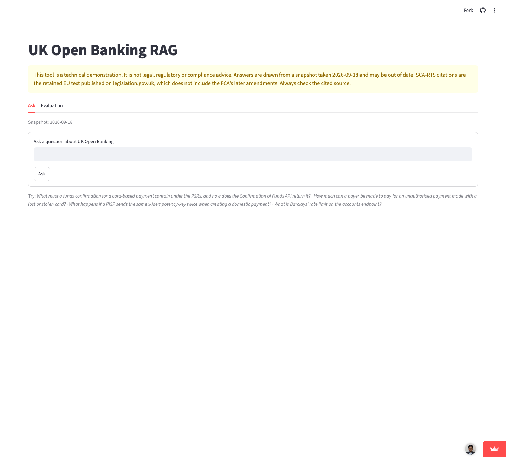

# UK Open Banking RAG

**Ask a question about UK Open Banking and get an answer that cites both the law and the API specification, or a clear "the sources don't cover this".**

[Live demo →](https://openbanking.streamlit.app/) · [Case study](docs/case-study.md) · [Architecture](docs/architecture.md)

<sub>Free hosting: the first visit after a quiet spell can take a minute to wake up.</sub>



> This tool is a technical demonstration. It is not legal, regulatory or compliance advice. Answers are drawn from a snapshot taken 2026-09-18 and may be out of date. SCA-RTS citations are the retained EU text published on legislation.gov.uk, which does not include the FCA's later amendments. Always check the cited source.

## The problem

Building on UK Open Banking means reading two very different texts side by side: the law (the Payment Services Regulations 2017 and the SCA-RTS) and the Open Banking Read/Write API specification. The useful questions sit across both, such as *"does the payment consent flow satisfy strong customer authentication?"*, and a good answer cites the regulation and the endpoint.

Generic RAG breaks on this material. Fixed-size chunks cut through regulation numbers and endpoint paths, which are the citations. Practitioners say "SCA" and "VRP" where the law spells things out. And in a compliance-adjacent tool, a confident answer with the wrong citation is worse than no answer.

## What it does

- Answers in plain English, with every claim linked to the exact regulation or API endpoint it came from.
- Decides whether a question needs the law, the API spec, or both, and searches accordingly.
- Says "the sources don't cover this" instead of guessing, including on plausible trap questions.
- Shows the retrieved sources next to every answer, so the reader can check it.

## Key product decisions

- **Declining beats guessing.** An answer with no valid citation is withheld, and the sources are shown instead. This cost one correct answer in the latest run, but an answer nobody can check should not be shown.
- **Chunk by the source's own structure, not by size.** One regulation or one API operation per chunk, with links built from the source's own identifiers. Checking the output against the source exposed that the obvious parser had silently dropped 35 amended regulations.
- **Measure before adopting.** Expanding abbreviations fixed "SCA" and "VRP" but broke "AIS", so it was dropped and the gap is tracked in the eval instead. The legal-domain embedding model retrieved worse sources (0.41 vs 0.55 relevance) at six times the price, so the general model stayed.
- **Keyword rules can widen a search, never narrow it.** The original keyword shortcut caused 5 of the 6 cross-cutting misses by sending "under the PSRs… which endpoints?" to the law only.

## Results & evidence

Measured on a 40-question golden set in four bands of 10 (law only, spec only, cross-cutting, unanswerable), written from the source text. The full method is in the [case study](docs/case-study.md).

| | Result |
|---|---|
| Unanswerable questions correctly declined | **10/10** in every run, including a trap question with a related but wrong article retrievable |
| Routing to the right source(s), answerable questions | 21/30 → **26/30** after fixing the router (cross-cutting: 4/10 → 8/10) |
| Correct answer-or-decline decision, answerable questions | 21/30 (cross-cutting 5/10) |
| Groundedness / correctness (LLM-judged, relative) | 0.99 / 0.53 |
| Embedding A/B | `voyage-4-lite` beat the legal-domain `voyage-law-2` on retrieval relevance (0.55 vs 0.41) at equal correctness and a sixth of the price |

The weak spot is stated, not hidden: questions that bridge a regulation and an endpoint are still often declined (5/10 correct decisions). The case study explains why.

## Scope & limits

- **A snapshot, not live law.** Sources were pinned on 2026-09-18. Nothing updates automatically.
- **Sources included:** the Payment Services Regulations 2017, the SCA-RTS (EU) 2018/389 as retained, and the Open Banking Read/Write API specification v4.0.1.
- **Not included:** the FCA Handbook, the FCA's amended SCA-RTS, bank-specific documentation, payment scheme rules.
- **Field-level questions miss.** The API spec is indexed one operation at a time, so schema fields are named but not searchable.
- **The eval is small and self-written.** 40 questions with 10 per band, and the LLM-judged scores are for comparing runs, not absolute claims. Refusal and routing accuracy involve no model.

## Next in roadmap

- Add the FCA Handbook and the FCA's current SCA-RTS, replacing the retained EU text.
- Hybrid keyword and vector search, aimed at the abbreviation gap the eval measures.
- Let the generator connect law and API only when both kinds of source were retrieved (the latest run showed it leaking into law-only questions).
- Measure run-to-run variance, so small score differences can be trusted.

<details>
<summary><strong>Tech stack & running locally</strong></summary>

**Stack:** Python 3.12, Google Gemini (generation), Gemma 4 31B (evaluation judge), Voyage AI embeddings, Chroma, Streamlit. No RAG framework: each stage is a short, tested Python module.

Needs [uv](https://docs.astral.sh/uv/), plus API keys for Google Gemini and Voyage AI (both have free tiers).

```bash
uv sync
cp .env.example .env          # then fill in GEMINI_API_KEY and VOYAGE_API_KEY
uv run python -m obrag.index.build      # fetches the pinned sources and builds the index
uv run streamlit run src/obrag/app/streamlit_app.py
```

The repo already includes a built index (`data/chroma`), so the build step is only needed to rebuild it. On the Gemini free tier, set `OBRAG_GENERATION_MODEL=gemini-3.5-flash-lite` in `.env`: the default `gemini-3.8-flash` allows 20 requests a day.

Run the tests with `uv run pytest`, and the evaluation with `uv run python -m obrag.evaluation.runner --label <name>` (set `OBRAG_JUDGE_MODEL=gemma-4-31b-it` on the free tier).

</details>

## Source attribution

- The Payment Services Regulations 2017: Crown copyright, from [legislation.gov.uk](https://www.legislation.gov.uk/uksi/2017/752), reused under the [Open Government Licence v3.0](https://www.nationalarchives.gov.uk/doc/open-government-licence/version/3/).
- Commission Delegated Regulation (EU) 2018/389: as published by [legislation.gov.uk](https://www.legislation.gov.uk/eur/2018/389); © European Union.
- Open Banking Read/Write API specifications: © Open Banking Limited, from [OpenBankingUK/read-write-api-specs](https://github.com/OpenBankingUK/read-write-api-specs), under the [Open Banking Open Licence](https://www.openbanking.org.uk/open-licence/).
