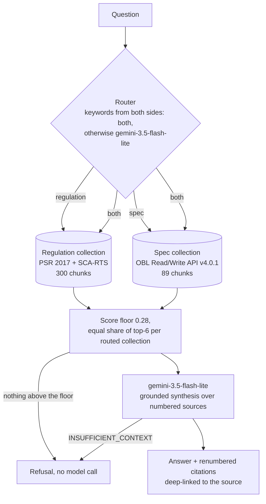

# Architecture

Every stage is a plain Python module with one job (`src/obrag/`): `ingest/` fetches and chunks, `index/` embeds and stores, `query/` routes, retrieves and generates, `evaluation/` scores, `app/` is the Streamlit shell. `query.pipeline.ask()` is the only entry point the UI and the eval call.

## Sources and chunking

| Source | Pinned as | Chunk unit | Citation and link |
|---|---|---|---|
| Payment Services Regulations 2017 | legislation.gov.uk CLML XML | one regulation or schedule paragraph, sub-paragraphs kept inside | each provision's own `DocumentURI`, e.g. `/uksi/2017/752/regulation/100` |
| SCA-RTS (EU) 2018/389 | legislation.gov.uk CLML XML (retained EU text) | one article | the article's `DocumentURI` |
| OBL Read/Write API spec | git tag `v4.0.1-Update-1` | one operation (method + path), with parameters and responses resolved from `$ref`s | the spec file at the pinned tag |

Both sources are already structured, so chunks follow that structure rather than a character window. Citations come from identifiers in the source (CLML `DocumentURI`, OpenAPI method and path), not from reconstructed numbers.

## Why two collections

Regulation provisions and API operations differ in structure, length and vocabulary. A single flat index lets one side crowd out the other. This happened even with separate collections: the spec's near-identical consent endpoints took 5 of 6 slots on a mixed question until each routed collection got a guaranteed equal share. Separate collections also give v2 a clean seam: per-ASPSP documentation or the FCA Handbook is a new collection and a new routing target, not a redesign.

## Why no framework

Both sources are already structured: OpenAPI operations and CLML provisions. A generic text splitter throws that structure away, and with it the citation metadata that makes a grounded answer checkable. Chunking by operation and by provision is a short module per source, and each chunk maps one-to-one onto how someone would cite it.

## Models

| Role | Model | Why |
|---|---|---|
| Embeddings | `voyage-4-lite` | cheapest current-generation Voyage model; `voyage-law-2` A/B in the case study |
| Router | `gemini-3.5-flash-lite` | one-word output; skipped only when keywords from both sides send a question to both collections |
| Generation | `gemini-3.5-flash-lite` | free tier allows 500 requests/day; `gemini-3.8-flash` (the code default) allows 20 |
| Eval judge | `gemma-4-31b-it` | free, and a different model family from the generator; `gemini-3.1-pro-preview` has no free quota |

Model choices other than the code defaults are set in `.env` (`OBRAG_GENERATION_MODEL`, `OBRAG_JUDGE_MODEL`, `OBRAG_EMBEDDING_MODEL`), so moving to paid models needs no code change.
